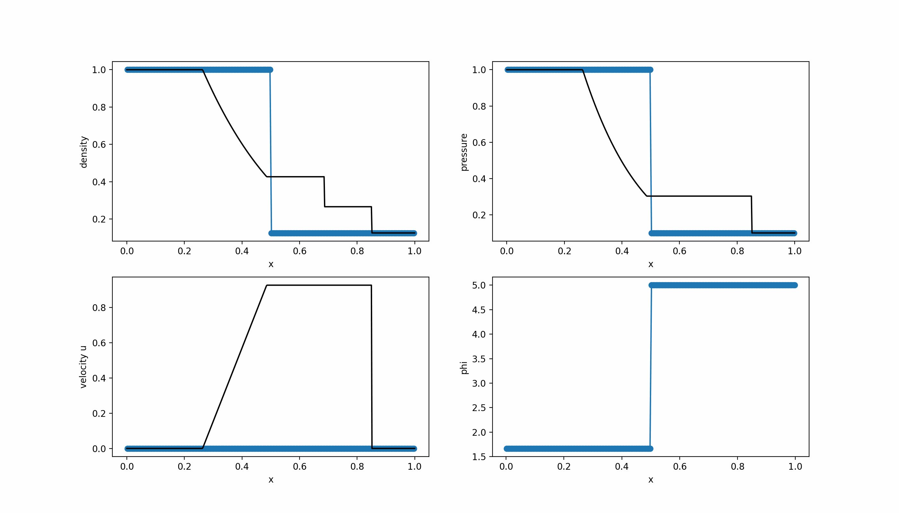
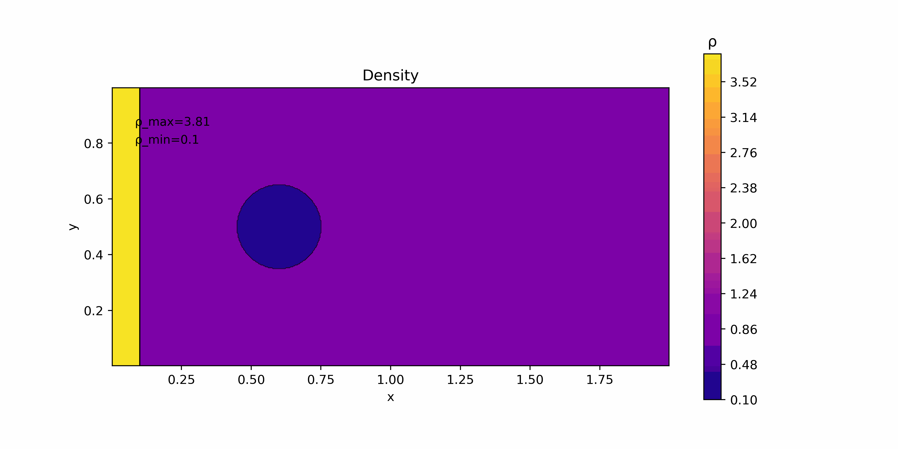
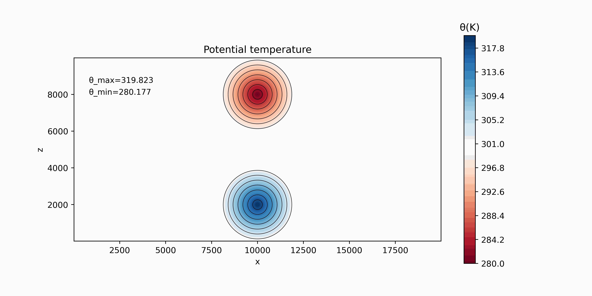
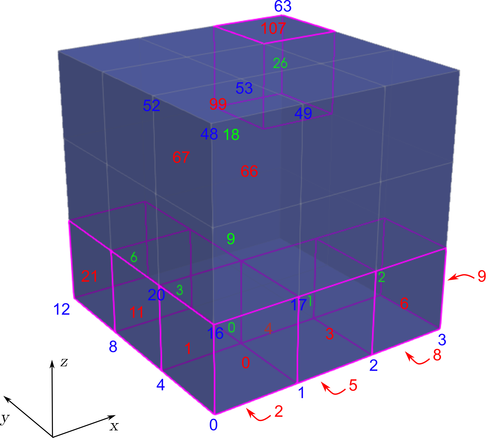
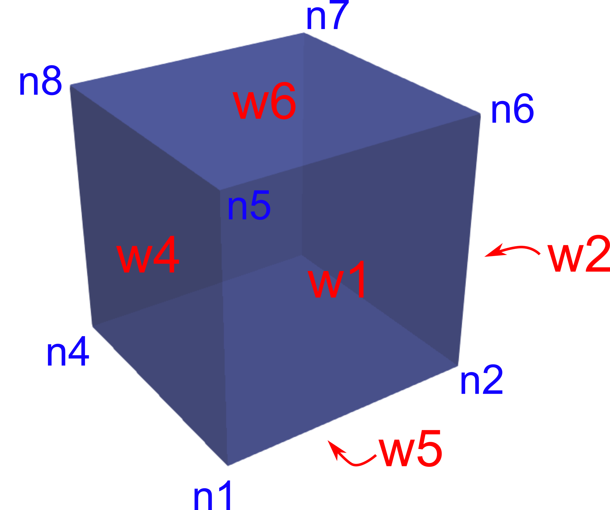

# EHOW3D (Euler High Order WENO/TENO 3D)


## Introduction

This repository includes a very high-order CFD solver for academic purposes. The solver allows the use of 1-st, 3-rd, 5-th and 7-th order WENO, TENO and linear reconstruction in space. This code allows the simulation of:

- Linear transport
- Burgers' equation
- Compressible Euler equations with gravitational source term.

The high order WENO and TENO schemes implemented in this code allow the simulation of turbulent flows using an Implicit Large Eddy Simulation (ILES) framework. ILES methods accurately reproduce the statistical behavior of turbulent flows. The  truncation errors of the scheme play the role of the common sub-grid scale filters used in traditional LES methods. High-fidelity simulations can be achieved when using this approach. A Kelvin-Helmholtz instability computed by EHOW-3D is shown below.

<figure style="text-align: center;">
  
</figure>

## Installation

Clone the repository in your local computer:

```git clone https://github.com/navasmontilla/EHOW3D_public.git```

Compile the program as follows:

```make```

Note that the *Makefile* considers the flags ```-Wall  -fopenmp``` by default, but the user can customize the compiling flags as desired. 

This software relies on other dependencies, listed below:

- [GCC](https://gcc.gnu.org/) or other C compiler
- [Paraview](https://www.paraview.org/), for data visualization
- [Jupyter Notebook](https://jupyter.org/) (optional), for pre- and post-processing
- [Python3](https://www.python.org/downloads/), for pre- and post-processing. The following packages need to be installed using ```pip install```:
	- *matplotlib*
	- *numpy*
	- *scipy*
 	- *imageio*
	- *vtk*
	- *pyvista*


## Automated test

To check the functionality of the software, an automated test composed of 6 benchmarks can be run as follows:

```python3 python/autotest.py nt rec ord```

where 
- ```nt``` is the number of threads
- ```rec``` is the reconstruction method (0: WENO, 1: TENO, 2: Optimal)
- ```ord``` is the order of accuracy (**Only 1, 3, 5 and 7 are available**)

Example usage for 8 threads, using WENO and order 3: ```python3 python/autotest.py 8 0 3```
  
The benchmarks include:

- A convergence rate test for the linear scalar equation
- 4 Riemann Problems (RP) for the Euler equations
- The colliding thermals test case for the Euler equations with gravity

Within this test, the program is compiled and executed for every benchmark, giving a *Passed*/*Not Passed* output on the terminal after the execution. The results can be visualized in [autotest/autotest.md](autotest/autotest.md)

## Example usage

To setup a simulation case, some Jupyter Notebooks has been created, including all the relevant information for the user:

### Scalar transport

- Setting up a 1D linear transport case:

- Setting up a 3D linear transport case:

### Compressible flow (homogeneus Euler equations)

- Setting up a 1D Riemann Problem for the  Euler equations (sod shock problem): [caseRP](python/caseRP.py)
  <figure style="text-align: center;">
  
  </figure>
- Setting up a 2D simulation case for the  Euler equations (shock-bubble test case): [caseShockBub](python/caseShockBub.py)
  <figure style="text-align: center;">
  
  </figure>
- Setting up a 3D simulation case for the  Euler equations (Richtmeyer Meshkov instability): [caseRM3D](python/caseRM3D.py)
  <figure style="text-align: center;">
  
  </figure>
  
### Atmospheric flow (Euler equations with gravity source term)
  
- Setting up a 2D atmospheric simulation case (colliding thermals test case): [caseExample](python/caseExample.py)
    <figure style="text-align: center;">
    
    </figure>

## Functionality documentation

For a detailed documentation of the main programming structures and functions of the code, see [the API documentation](doc/docAPI.md)

### Code organization and libraries

```
EHow3D/
├── ehow3d.c
├── Makefile
├── lib/
│   ├── closures.c
│   ├── closures.h
│   ├── definitions.h
│   ├── ibmutils.c
│   ├── ibmutils.h
│   ├── mathutils.c
│   ├── mathutils.h
│   ├── numcore.c
│   ├── numcore.h
│   ├── postproc.c
│   ├── postproc.h
│   ├── preproc.c
│   ├── preproc.h
│   ├── reconst.c
│   ├── reconst.h
│   ├── solvers.c
│   ├── solvers.h
│   └── structures.h
├── python/
│   ├── utils.py
│   ├── autotest.py
│   ├── caseExample.py
│   └── caseExample.ipynb
├── case/
│   ├── configure.input
│   ├── equilibrium.out
│   ├── initial.out
│   └── out/
└── README.md
```

#### main Directory
- **ehow3d.c**: Main source file for the EHow3D solver.
- **Makefile**: Makefile for compiling the code.
- **lib/**: Directory containing library files and utilities.
- **python/**: Directory containing Python scripts for pre/post-processing and automation.
- **case/**: Directory for case configuration and output files.
- **README.md**: Documentation for the EHow3D solver.

#### lib Directory
- **definitions.h**: Definitions and constants used across the code.
- **structures.h**: Data structures used in the code.
- **closures.c/h**: Functions and headers related to pressure closures.
- **ibmutils.c/h**: Utilities for immersed boundary method.
- **mathutils.c/h**: Mathematical utilities.
- **numcore.c/h**: Core numerical methods and routines.
- **postproc.c/h**: Post-processing utilities.
- **preproc.c/h**: Pre-processing utilities.
- **reconst.c/h**: Reconstruction methods for high-order schemes.
- **solvers.c/h**: Riemann solver routines.

#### python Directory
- **utils.py**: Utility functions.
- **autotest.py**: Script for automated testing of the solver.
- **caseExample.ipynb**: Script for generating case configurations.


### Configuration of the code for compilation

The file ```lib/definitions.h``` contains some definitions and constants that will be used for compilation. The most relevant for the user are:

```c
//reconstruction method
#define TYPE_REC 0 //This is 0 for WENO, 1 for TENO and 2 for optimal polynomial reconstruction

//Equations
#define EQUATION_SYSTEM 2 // 0: Linear advection, 1: Burgers, 2: Compressible Euler 

//Source terms for Euler
#define ST 3// 0: Source OFF, 1: Source ON (augmented version using HLLS), 2: Source ON (perturbation version), 3: Source ON (perturbation version, total energy is conserved)

//Multicomponent flow
#define MULTICOMPONENT 0 // 0: Single component Euler equations, 1: Multicomponent Euler equations (two components with different gamma).
#define MULTI_TYPE 2     //1: gamma formulation, :2  1/(gamma-1) formulation. ATENTION: Option =2 recommended (see R. Abgrall, S. Karni, Computations of Compressible Multifluids, JCP 169 (2001))

//Solvers
#define SOLVER 0 //0: HLL solver, 1: HLLC solver, 2: HLLS solver

//OpenMP configuration
#define NTHREADS 4 //This is the number of threads

//Output files
#define WRITE_VTK 1  //1: vtk file is printed
#define WRITE_LIST 1 //1: list *.out file is printed

//Printing variables (vtk). Select what variables will be printed in vtk files:
#define print_RHO 0
#define print_VELOCITY 1
#define print_ENERGY 0
#define print_PRESSURE 0
#define print_OVERPRESSURE 1
#define print_SOLUTES 0
#define print_POTENTIALTEM 1

//Reading initial data
#define READ_INITIAL 1 //1: Initial data is read from file, 2: Iinitial data is set in update_initial()
```

### Equations solved

There is the possibility of solving:

#### Linear scalar transport

To run this model, we must define:

```c
#define EQUATION_SYSTEM 0 
```

and the following equation is solved:

$$\frac{\partial u}{\partial t} + v_x\frac{\partial u}{\partial x}+ v_y\frac{\partial u}{\partial y}+ v_z\frac{\partial u}{\partial z}= 0 $$

where $v_x$, $v_y$ and $v_z$ the are x, y and z velocities.

#### Burgers equation

To run this model, we must define:

```c
#define EQUATION_SYSTEM 1 
```

and the following equation is solved:

$$ \frac{\partial u}{\partial t} + u\frac{\partial u}{\partial x}+ u\frac{\partial u}{\partial y}+ u\frac{\partial u}{\partial z}=0 $$

#### Euler equations:
To run this model, we must define:

```c
#define EQUATION_SYSTEM 2 
```

and the following system of equations is solved:

$$\begin{align}
\frac{\partial \rho}{\partial t} + \nabla \cdot (\rho \mathbf{v}) &= 0 \tag{Continuity} \\
\frac{\partial (\rho \mathbf{v})}{\partial t} + \nabla \cdot \left(\rho \mathbf{v} \otimes \mathbf{v} + p \mathbf{I}\right) &= \rho \mathbf{g} \tag{Momentum} \\
\frac{\partial E}{\partial t} + \nabla \cdot \left((E + p) \mathbf{v}\right) &= \rho \mathbf{v} \cdot \mathbf{g} \tag{Energy}
\end{align}$$

where $\rho$ is density, $\mathbf{v}$ is the velocity vector, $p$ is pressure and $\mathbf{g}=(0,0,g)^T$ is the gravitational acceleration vector. The energy is defined as  the sum of kinetic and internal energy

$$E=\rho(\frac{1}{2}\mathbf{v}+e)$$

One should note the relations $p=(\gamma-1)\rho e\equiv (\gamma-1)(E-\frac{1}{2}\rho\mathbf{v})$.

- When setting ```#define ST 0```, we assume $g=0$. 

- When setting  ```#define ST 1```, we consider non-zero gravity and use the solver HLLS. 

- When setting  ```#define ST 2```, we consider non-zero gravity and use the solver HLL in fluctuation version. 

- When setting ```#define ST 3```  we consider non-zero gravity and use the solver HLL in fluctuation version. Besides,the equation for the conservation of energy is solved in fully conservative form, defining energy as $E_T=\rho(\frac{1}{2}\mathbf{v}+e+gz)$, yielding to

$$\begin{align}
\frac{\partial E_T}{\partial t} + \nabla \cdot \left((E_T + p) \mathbf{v}\right) &= 0 
\end{align}$$


It is possible to run the two-component Euler equations, setting:
```c
#define MULTICOMPONENT 1
```
and set ```MULTI_TYPE=1``` to choose this Gamma formulation  $\phi =\gamma$ or  ```MULTI_TYPE=2``` to use this formulation $\phi =1/(\gamma-1)$  (see R. Abgrall, S. Karni, Computations of Compressible Multifluids, JCP 169 (2001)) for

$$\frac{\partial \rho\phi}{\partial t} + \frac{\partial \rho u\phi}{\partial x}=0$$


### Input data

Inside the **case/** directory we will find all files corresponding to the simulation case, we need as input files:

- **configure.input**: Input configuration file for running a case, that includes the global configuration and is of the following form:

```
/////SIMULATION_SETUP//////
FinalTime		0.2
DumpTime		0.05
CFL			0.25
Order			5

////////MESH_SETUP/////////
xcells			80
ycells			100
zcells			80
SizeX			0.80
SizeY			1.0
SizeZ			0.80

///////BOUNDARY_COND///////
Face_1(-y)			3
Face_2(+x)			3
Face_3(+y)			3
Face_4(-x)			3
Face_5(-z)			3
Face_6(+z)			3

///////LINEAR_TRANSPORT///////(if_applicable)
u_x                     1.0
u_y                     1.0
u_z                     1.0
```

- **initial.out**: Input file for initial conditions, that is of the following form (for scalar and Euler equations respectively):
``` 
VARIABLES = X, Y, Z, u 
CELLS = 40, 40, 40,
0.0075 0.0075 0.0075 0.0 
0.0075 0.0075 0.0225 0.0
0.0075 0.0075 0.0375 0.0 
...
```
 
``` 
VARIABLES = X, Y, Z, u, v, w, rho, p, phi 
CELLS = 40, 40, 40,
0.0075 0.0075 0.0075 0.0 0.0 0.0 1.0 1.0 0.0
0.0075 0.0075 0.0225 0.0 0.0 0.0 1.0 1.0 0.0
0.0075 0.0075 0.0375 0.0 0.0 0.0 1.0 1.0 0.0
...
 ```
The initial conditions can also be set in, when setting ```READ_INITIAL = 0```:
```c 
int update_initial(t_mesh *mesh);
```

- **equilibrium.out**: Input file for equilibrium state (only when considering atmospheric cases). Similar structure than above.

### Output data

This software allows printing data in *.vtk format and ASCII *.out files. To activate each of those output file types, use the macros:

```c
#define WRITE_VTK 1  //print *.vtk
#define WRITE_LIST 1 //print ASCII *.out
```

For *.vkt files, it is posible to choose the variables to print by means of additional macros. For instance, if we want to print X,Y,Z momentum and pressure, do:
```c
#define print_RHO 0
#define print_MOMENTUM 1
#define print_ENERGY 0
#define print_PRESSURE 1
#define print_OVERPRESSURE 0
#define print_SOLUTES 0
#define print_POTENTIALTEM 0
```

The time lapse for writing files is set as *DumpTime* in the file *configure.input*. 

### The computational mesh

The computational mesh is constructed as follows:

<figure style="text-align: center;">
  
</figure>

with cell numbers in green, wall numbers in red and node numbers in blue.

Each reference element (volume cell) is defined as follows:

<figure style="text-align: center;">
  
</figure>

with wall numbers in red and node numbers in blue. These are defined in the corresponding data structures in *structures.h* (see [the API documentation](doc/docAPI.md)).

### Boundary conditions

The available boundary conditions are:

* 1: Periodic

* 2: User defined

* 3: Transmissive (Euler). The numerical flux is set as the physical flux at the interface, using:
```c 
void compute_transmissive_euler(t_wall *wall, int wp)
```

* 4: Solid wall (Euler). Defined as a slip boundary condition which is based on the HLL flux, using:
```c 
void compute_solid_euler_hlle(t_wall *wall, double *lambda_max, int wp)
```

### Spatial reconstructions

Spatial reconstructions are implemented using 1D splitting. The available reconstructions are:

- Linear 3, 5 and 7
- WENO 3, 5 and 7
- TENO 3, 5 and 7

To select the spatial reconstruction method, use:
 ```c
#define TYPE_REC 0 //This is 0 for WENO, 1 for TENO and 2 for UWC
```

Note that **only orders 1, 3, 5 and 7 are available**.

### Time integrator

The time stepping is done using a Strong Stability Preserving Runge-Kutta 3 (SSPRK3) method when the spatial order is greater than 1, or with a 1-st order explicit Euler method, when the spatial order is 1.

### Riemann solvers

For the **linear scalar equation**, we use an upwind flux definition, implemented in:
```c 
void compute_linear_flux(t_wall *wall,double *lambda_max);
```
For the **Burgers equation**, we also use an upwind flux definition, implemented in:
```c 
void compute_burgers_flux(t_wall *wall,double *lambda_max);
```
For **Euler equations**, the available solvers are:
- HLL solver: 
```c 
void compute_euler_HLLE(t_wall *wall,double *lambda_max) 
```
- HLLS solver: 
```c 
void compute_euler_HLLS(t_wall *wall,double *lambda_max) 
```
- HLLC solver: 
```c 
void compute_euler_HLLC(t_wall *wall,double *lambda_max)
```

**Note**: A positivity fix must be implemented in the HLLC solver to avoid stability issues

The x-split version of the solvers is implemented. It must be noted that the rotation matrices are simplified for the particular case of Cartesian geometries, leading to:
```c
	WL[1]=wall->UL[1]*wall->nx+wall->UL[2]*wall->ny+wall->UL[3]*wall->nz;
	WL[2]=-wall->UL[1]*wall->ny+wall->UL[2]*wall->nx+wall->UL[2]*wall->nz;
	WL[3]=wall->UL[3]*wall->nx+wall->UL[3]*wall->ny-wall->UL[1]*wall->nz;
```
where ```WL``` is the 3D vector in the local coordinates and  ```UL``` in the absolute coordinates.


## Numerical results

Some results are sorted in the following categories:

- [Benchmark #1: 1D Riemann problems](doc/benchmark1.md)
- [Benchmark #2: 2D Riemann problems](doc/benchmark2.md)
- [Benchmark #3: Two-fluid mixture problem](doc/benchmark3.md)
- [Benchmark #4: Convergence rate test](doc/benchmark4.md)
- [Benchmark #5: Taylor-Green vortex](doc/benchmark5.md)
- [Benchmark #6: Kelvin-Helmholtz instability](doc/benchmark6.md)
- [Benchmark #7: Colliding thermals](doc/benchmark7.md)

## Authorship

Authors:
 - Adrián Navas Montilla
 - Isabel Echeverribar 
 
Collaborators:
 - Javier Guallart Huertas (2022-2023)

Copyright (C) 2019-2024 The authors and collaborators.  

License type: Creative Commons Attribution-NonCommercial-NoDerivs 3.0 Spain (CC BY-NC-ND 3.0 ES https://creativecommons.org/licenses/by-nc-nd/3.0/es/deed.en) under the following terms: 

- Attribution — You must give appropriate credit and provide a link to the license.
- NonCommercial — You may not use the material for commercial purposes.
- NoDerivatives — If you remix, transform, or build upon the material, you may not distribute the modified material unless explicit permission of the authors is provided. 

If you want to contribute to this project or provide any feedback, please [contact us](mailto:anavas@unizar.es)! ;)

**Disclaimer:** This software is under development and it is distributed for research and/or academic purposes, WITHOUT ANY WARRANTY. In no event shall the authors be liable for any claim, damages or other liability, arising from, out of or in connection with the software or the use or other dealings in this software.

