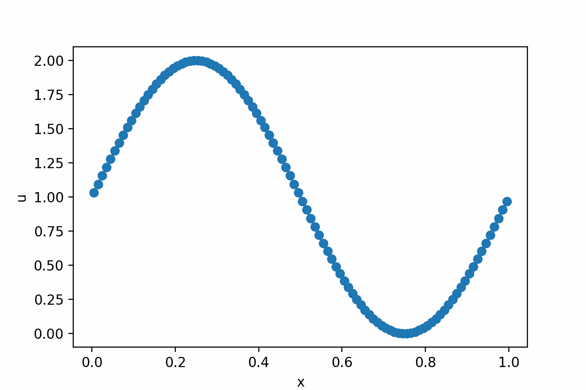
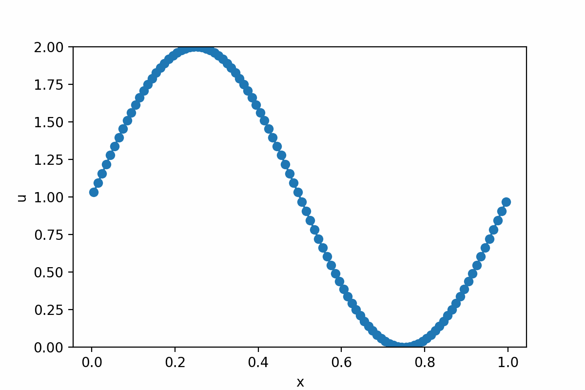
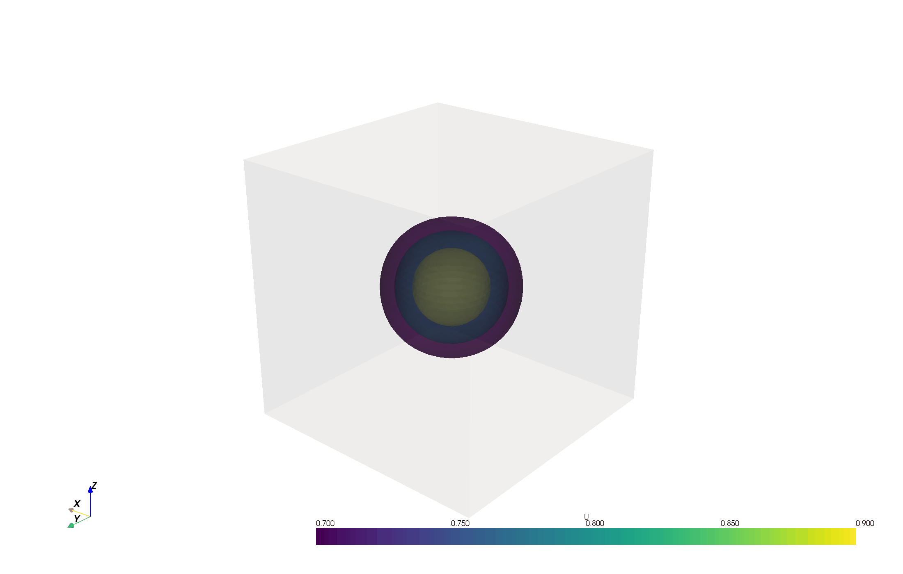
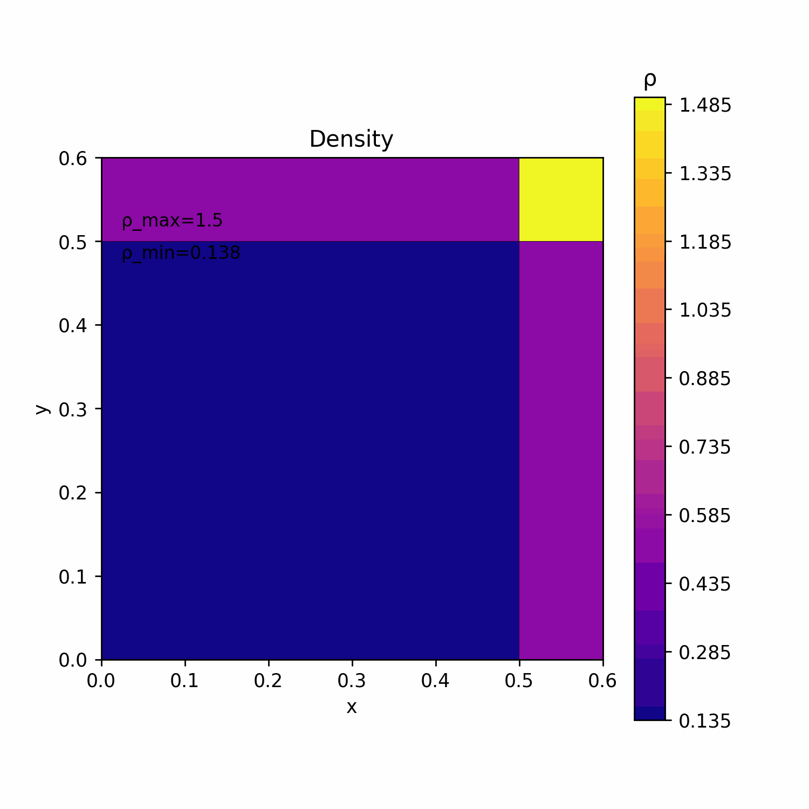
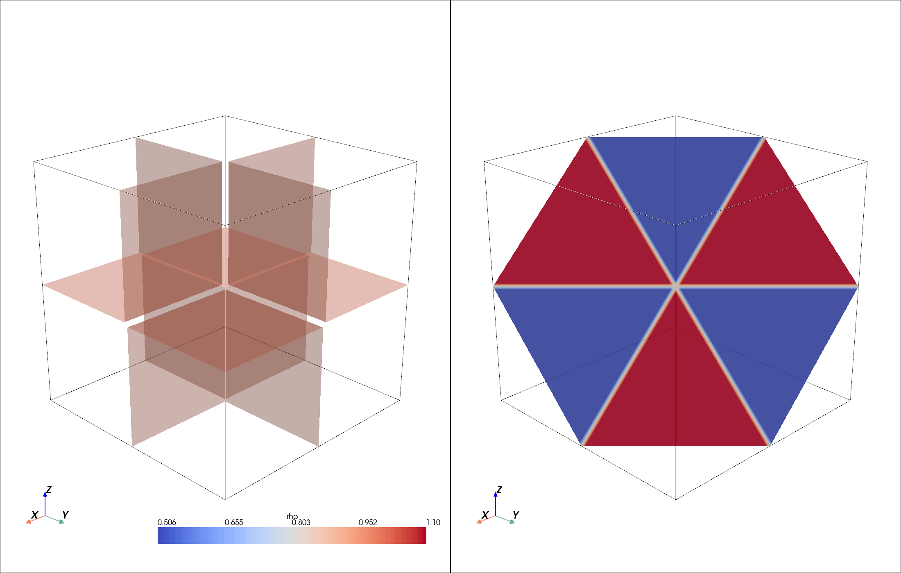
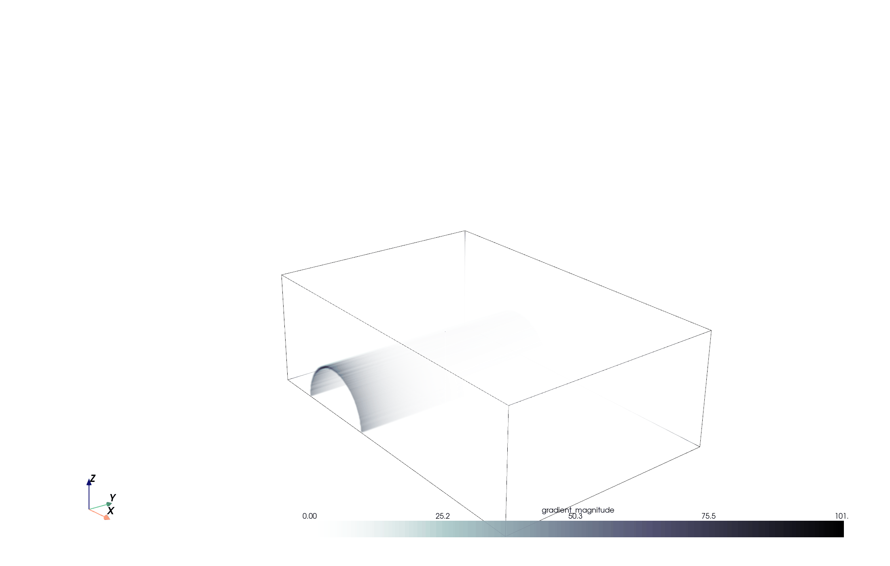

# CÆLUM: An academic high-order finite-volume solver for the compressible Euler equations and related problems


## Table of Contents

1. [Introduction](#introduction)
2. [Installation](#installation)
3. [Automated test](#automated-test)
4. [Example usage](#example-usage)
   - [Scalar problems](#scalar-problems)
   - [Compressible flow (homogeneous Euler equations)](#compressible-flow-homogeneous-euler-equations)
   - [Atmospheric flow (Euler equations with gravity source term)](#atmospheric-flow-euler-equations-with-gravity-source-term)
5. [Functionality documentation](#functionality-documentation)
   - [Code organization and libraries](#code-organization-and-libraries)
   - [Configuration of the code for compilation](#configuration-of-the-code-for-compilation)
   - [Equations solved](#equations-solved)
   - [Input data](#input-data)
   - [Output data](#output-data)
   - [The computational mesh](#the-computational-mesh)
   - [Boundary conditions](#boundary-conditions)
   - [Spatial reconstructions](#spatial-reconstructions)
   - [Time integrator](#time-integrator)
   - [Riemann solvers](#riemann-solvers)
6. [Other numerical results](#other-numerical-results)
7. [Community guidelines](#community-guidelines)
8. [Authorship](#authorship)


## Statement of need

`CÆLUM` is a hydrodynamic solver for compressible flows, which solves the Euler equations of gas dynamics by means of very high order essentially non-oscillatory finite volume schemes in cartesian meshes. A key feature of this software is that it also allows the simulation of simplified dry atmospheric flows in the meso- and micro-scale. The core of the solver is written in C but pre-processing and post-processing can be easily done using Jupyter Notebook as provided in the examples. The Weighted Essentially Non-Oscillatory (WENO)  and Targeted Essentially Non-Oscillatory (TENO) spatial reconstructions, in combination with Runge-Kutta integrators, are used in `CÆLUM` to achieve a high resolution in smooth regions of the flow and to capture discontinuous solutions without spurious oscillations. These schemes also allow to adopt an Implicit Large Eddy Simulation (iLES) framework when computing turbulent flows. The numerical diffusion plays the role of the explicit dissipative sub-grid model, being this a favorable choice when seeking simplicity and computational efficiency. In summary, this hydrodynamic solver is applicable to turbulent compressible flows, as well as low Mach number flows such as simplified dry atmospheric flows and other wave propagation phenomena. 

It is designed from an academic perspective, where clarity and accessibility are prioritized. Therefore, it includes user-friendly pre-processing and post-processing tools based on Python and Jupyter Notebook. The repository comes with a series of Python scripts for the configuration and visualization of various example flows, ranging from simple scalar advection in 1D to more complex atmospheric or compressible flow cases in 3D. These scripts rely on standard libraries such as `numpy`, `matplotlib` and `pyvista`, the latter being a powerful module for data visualization and rendering. Additionally, several Jupyter Notebooks are included, where the steps for configuring the simulation tool and visualizing the results are explained in detail.

Regarding the implementation of the solver, `CÆLUM` uses OpenMP, a directive-based threading library that allows parallel computing in multi-core CPUs. The modification of the base code by the inlcusion of pragmas is minimal, preserving the readability and clarity of the code.

<figure style="text-align: center;">
  
</figure>

## Installation instructions

Go to the desired location where you want to download CAELUM, e.g. ```me@myPc: SomeFolder/$``` and clone the repository in your local computer:

```git clone https://github.com/navasmontilla/CAELUM.git```

Go to CAELUM main folder ```me@myPc: SomeFolder/CAELUM/$``` and compile the program using *Makefile* as follows:

```make```

Compilation flags ```DEBUG``` and ```OMP```, for debugging and for multi-thread computing with OpenMP, are defined in ```Makefile```. ```DEBUG=0```  and ```OMP=1```  are set by default. For instance, if you seek serial computing, you can compile as follows:

```make OMP=0```

This software relies on other dependencies, listed below:

- [GCC](https://gcc.gnu.org/) or other C compiler
- [Python3](https://www.python.org/downloads/), for pre- and post-processing. The following packages need to be installed using ```pip install```:
	- *matplotlib*
	- *numpy*
	- *scipy*
 	- *imageio*
	- *pyvista*
	- *jupyter notebook*
	
To install Python3 and the above packages:

```
sudo apt update
sudo apt install -y python3 python3-pip
pip3 install pyvista matplotlib numpy scipy imageio notebook
```

Other possibility: you can also do it using a virtual environment in the main folder (```me@myPc: SomeFolder/CAELUM/$```):

```
sudo apt update
sudo apt install -y python3 python3-pip
python3 -m venv myenv
source myenv/bin/activate
pip3 install pyvista matplotlib numpy scipy imageio notebook
```

## Automated test

To check the functionality of the software, an automated test composed of 6 benchmarks can be run as follows from the main directory (```me@myPc: SomeFolder/CAELUM/$```):

```python3 python/autotest.py nt rec ord```

where 
- ```nt``` is the number of threads
- ```rec``` is the reconstruction method (0: WENO, 1: TENO, 2: Optimal)
- ```ord``` is the order of accuracy (**Only 1, 3, 5 and 7 are available**)

Example usage for 8 threads, using WENO and order 3: ```python3 python/autotest.py 8 0 3```
  
The benchmarks include:

- A convergence rate test for the linear scalar equation
- 4 Riemann Problems (RP) for the Euler equations
- The colliding thermals test case for the Euler equations with gravity

Within this test, the program is compiled and executed for every benchmark, giving a *Passed*/*Not Passed* output on the terminal after the execution. The results can be visualized in [autotest/autotest.md](autotest/autotest.md)

## Example usage

To get started in a user-friendly environment, some Jupyter Notebooks have been created:

-  [Getting started: setting up a linear transport case](python/caseScalar.ipynb)

-  [Computing and visualizing shock waves](python/caseRP3D.ipynb)

-  [First steps with atmospheric flows: the colliding thermals test case](python/caseCollidingBub.ipynb)

For a correct functionality, *Jupyter Notebook* must be launched from the software main directory, e.g. ```me@myPc: SomeFolder/CAELUM/$ jupyter notebook```

A more complete set of examples, scripted in Python, are listed below. The Python scripts to generate the cases below must be launched from the software main directory (```me@myPc: SomeFolder/CAELUM/$```).

### Scalar problems

- Setting up a 1D linear transport case: [caseLinear](python/caseLinear.py) ```python3 python/caseLinear.py```
  
  <figure style="text-align: center;">
  
  </figure>

- Setting up a 1D Burgers problem: [caseBurgers](python/caseBurgers.py) ```python3 python/caseBurgers.py```
  
  <figure style="text-align: center;">
  
  </figure>

- Setting up a 3D linear transport case: [caseLinear3D](python/caseLinear3D.py) ```python3 python/caseLinear3D.py```
  
  <figure style="text-align: center;">
  
  </figure>

### Compressible flow (homogeneus Euler equations)

- Setting up a 1D Riemann Problem for the  Euler equations (sod shock problem) [1]: [caseRP](python/caseRP.py) ```python3 python/caseRP.py```

  <figure style="text-align: center;">
  
  </figure>
  
- Setting up a 2D Riemann Problem for the Euler equations [2]: [caseRP2D](python/caseRP2D.py) ```python3 python/caseRP2D.py```

  <figure style="text-align: center;">
  
  </figure>
  
- Setting up a 3D Riemann Problem for the Euler equations [3]: [caseRP3D](python/caseRP3D.py) ```python3 python/caseRP3D.py```

  <figure style="text-align: center;">
  
  </figure>
  
- Advanced case: the shock-bubble test case [4]: [caseShockBub](python/caseShockBub.py) ```python3 python/caseShockBub.py```

  <figure style="text-align: center;">
  
  </figure>
  
- Advanced case: shock-cylinder interaction [5]: [caseShockCyl](python/caseShockCyl3D.py) [caseShockCyl_plots](python/caseShockCyl3D_plots.py) ```python3 python/caseShockCyl.py; python3 python/caseShockCyl_plots.py;```
  
  <figure style="text-align: center;">
  
  </figure>
  
- Advanced case: shock-induced turbulent mixing (Richtmeyer Meshkov instability): [caseRM3D](python/caseRM3D.py) [caseRM3D_plots](python/caseRM3D_plots.py) ```python3 python/caseRM3D.py; python3 python/caseRM3D_plots.py;```
  
  <figure style="text-align: center;">
  
  </figure>
  
### Atmospheric flow (Euler equations with gravity source term)
  
- Setting up a 2D atmospheric simulation case (colliding thermals test case) [6]: [caseCollidingBub](python/caseCollidingBub.py) ```python3 python/caseCollidingBub.py```
    
    <figure style="text-align: center;">
    
    </figure>
    
- Setting up a 3D atmospheric simulation case (colliding thermals test case): [caseCollidingBub3D](python/caseCollidingBub3D.py) [caseCollidingBub3D_plots](python/caseCollidingBub3D_plots.py) ```python3 python/caseCollidingBub.py```
    
    <figure style="text-align: center;">
    
    </figure>
    
References and sources for the cases above:

[1] Sod, G. A. (1978). A Survey of Several Finite Difference Methods for Systems of Nonlinear Hyperbolic Conservation Laws", IJournal of Computational Physics, 1978, 27 (1), pp. 1-31.

[2] Lax, P. D., & Liu, X. D. (1998). Solution of two-dimensional Riemann problems of gas dynamics by positive schemes. SIAM Journal on Scientific Computing, 19(2), 319-340.

[3] Nils Hoppe, Nico Fleischmann, Benedikt Biller, Stefan Adami, Nikolaus A. Adams, A systematic analysis of three-dimensional Riemann problems for verification of compressible-flow solvers, Computers & Fluids, Volume 278, 2024, 106298

[4] Mandli, K.T., Ahmadia, A.J., Berger, M.J., Calhoun, D.A., George, D.L.,Hadjimichael, Y., Ketcheson, D.I., Lemoine, G.I., LeVeque, R.J., 2016.Clawpack: building an open source ecosystem for solving hyperbolic PDEs. PeerJ Computer Science. doi:10.7717/peerj-cs.

[5] Langseth, J.O. (2001). 3D Visualization of Shock Waves Using Volume Rendering. In: Toro, E.F. (eds) Godunov Methods. Springer, New York, NY. 

[6] Norman, M. R. (2021). A high-order WENO-limited finite-volume algorithm for atmospheric flow using the ADER-differential transform time discretization. Quarterly Journal of the Royal Meteorological Society, 147(736), 1661-1690.

## Functionality documentation

For a detailed documentation of the main programming structures and functions of the code, see [the API documentation](doc/docAPI.md)

### Code organization and libraries

```
caelum/
├── main.c
├── Makefile
├── lib/
│   ├── closures.c
│   ├── closures.h
│   ├── definitions.h
│   ├── ibmutils.c
│   ├── ibmutils.h
│   ├── mathutils.c
│   ├── mathutils.h
│   ├── numcore.c
│   ├── numcore.h
│   ├── postproc.c
│   ├── postproc.h
│   ├── preproc.c
│   ├── preproc.h
│   ├── reconst.c
│   ├── reconst.h
│   ├── solvers.c
│   ├── solvers.h
│   └── structures.h
├── python/
│   ├── utils.py
│   ├── autotest.py
│   ├── caseExample.py
│   └── caseExample.ipynb
├── case/
│   ├── configure.input
│   ├── equilibrium.out
│   ├── initial.out
│   └── out/
└── README.md
```

#### main Directory
- **main.c**: Main source file for the CÆLUM solver.
- **Makefile**: Makefile for compiling the code.
- **lib/**: Directory containing library files and utilities.
- **python/**: Directory containing Python scripts for pre/post-processing and automation.
- **case/**: Directory for case configuration and output files.
- **README.md**: Documentation for the CÆLUM solver.

#### lib Directory
- **definitions.h**: Definitions and constants used across the code.
- **structures.h**: Data structures used in the code.
- **closures.c/h**: Functions and headers related to pressure closures.
- **ibmutils.c/h**: Utilities for immersed boundary method.
- **mathutils.c/h**: Mathematical utilities.
- **numcore.c/h**: Core numerical methods and routines.
- **postproc.c/h**: Post-processing utilities.
- **preproc.c/h**: Pre-processing utilities.
- **reconst.c/h**: Reconstruction methods for high-order schemes.
- **solvers.c/h**: Riemann solver routines.

#### python Directory
- **utils.py**: Utility functions.
- **autotest.py**: Script for automated testing of the solver.
- **caseExample.ipynb**: Script for generating case configurations.


### Configuration of the code for compilation

The file ```lib/definitions.h``` contains some definitions and constants that will be used for compilation. The most relevant for the user are listed below. Here, we provide a summary with links to other sections where some of these features are explained more in detail.

#### Reconstruction Method

```c
#define TYPE_REC 0
```

- *Description*: Defines the type of high order reconstruction method used. See more info [here](#spatial-reconstructions).
- *Possible Values*:
  - `0`: WENO (Weighted Essentially Non-Oscillatory).
  - `1`: TENO (Targeted Essentially Non-Oscillatory).
  - `2`: Optimal Polynomial Reconstruction.

#### Equation System

```c
#define EQUATION_SYSTEM 2
```

- *Description*: Specifies the type of equation system to solve. See more info [here](#equations-solved).
- *Possible Values*:
  - `0`: Linear advection equation.
  - `1`: Burgers' equation.
  - `2`: Compressible Euler equations.

#### Other features for Euler equations

```c
#define ST 3
```

- *Description*: Controls the inclusion of source terms for the Euler equations.  See more info [here](#equations-solved).
- *Possible Values*:
  - `0`: Source terms OFF.
  - `1`: Source terms ON (augmented version, needs the use of HLLS).
  - `2`: Source terms ON (perturbation version, needs the use of HLL).
  - `3`: Source terms ON (perturbation version and total energy is conserved, needs the use of HLL).


```c
#define MULTICOMPONENT 0
```

- *Description*: Indicates whether single or multicomponent Euler equations are used. See more info [here](#equations-solved).
- *Possible Values*:
  - `0`: Single component Euler equations.
  - `1`: Multicomponent Euler equations (two components with different specific heat ratio $\gamma$).


```c
#define MULTI_TYPE 2
```

- *Description*: Defines the type of multicomponent formulation used. See more info [here](#equations-solved).
- *Possible Values*:
  - `1`: Gamma ($\gamma$) formulation.
  - `2`: $\frac{1}{\gamma - 1}$ formulation (recommended, as per R. Abgrall and S. Karni in JCP 169 (2001)).

#### Solver Selection for Euler equations

```c
#define SOLVER 0
```

- *Description*: Specifies the solver used for the numerical method. See more info [here](#riemann-solvers).
- *Possible Values*:
  - `0`: HLL (Harten-Lax-van Leer) solver.
  - `1`: HLLC (Harten-Lax-van Leer Contact) solver.
  - `2`: HLLS (Harten-Lax-van Leer Source) solver.

#### OpenMP Configuration

```c
#define NTHREADS 4
```

- *Description*: Defines the number of OpenMP threads used for parallel execution.
- *Possible Values*: Any integer value representing the number of threads. For example:
  - `4`: Use 4 threads for parallel computation.

#### Output Files Configuration


```c
#define WRITE_VTK 1
```

- *Description*: Controls whether a VTK file is generated for visualization.  See more info [here](#output-data).
- *Possible Values*:
  - `0`: VTK file is not generated.
  - `1`: VTK file is generated.


```c
#define WRITE_LIST 1
```

- *Description*: Controls whether a list (`*.out`) file is generated. See more info [here](#output-data).
- *Possible Values*:
  - `0`: List file is not generated.
  - `1`: List file is generated.

#### Variable Printing (VTK)

- *Description*: Defines which variables are printed to VTK files for visualization.

```c
#define print_RHO 0
#define print_VELOCITY 1
#define print_ENERGY 0
#define print_PRESSURE 0
#define print_OVERPRESSURE 1
#define print_SOLUTES 0
#define print_POTENTIALTEM 1
```

- *Possible Values for Each Variable*:
  - `0`: Do not print this variable.
  - `1`: Print this variable.

- *Variables*:
  - `print_RHO`: Density.
  - `print_VELOCITY`: Velocity vector.
  - `print_ENERGY`: Energy.
  - `print_PRESSURE`: Pressure.
  - `print_OVERPRESSURE`: Pressure difference from the equilibrium pressure.
  - `print_SOLUTES`: Passive solute concentration.
  - `print_POTENTIALTEM`: Potential temperature.

#### Initial Data Input

```c
#define READ_INITIAL 1
```

- *Description*: Controls how the initial data is loaded. See more info [here](#input-data).
- *Possible Values*:
  - `1`: Initial data is read from a file.
  - `2`: Initial data is set programmatically in the function `update_initial()`.
  
#### Physical constants

```c
#define PI 3.141592653589793
#define _g_ 9.8
#define _gamma_ 1.4
#define _R_ 287.058
#define _p0_ 1.0E5
```

- *Variables*:
  - `PI`: Pi number.
  - `_g_`: Gravity acceleration.
  - `_gamma_`: Specific heats ratio.
  - `_R_`: Ideal gas constant.
  - `_p0_`: Reference atmospheric pressure.


### Equations solved

There is the possibility of solving:

#### Linear scalar transport

To run this model, we must define:

```c
#define EQUATION_SYSTEM 0 
```

and the following equation is solved:

$$\frac{\partial u}{\partial t} + v_x\frac{\partial u}{\partial x}+ v_y\frac{\partial u}{\partial y}+ v_z\frac{\partial u}{\partial z}= 0 $$

where $v_x$, $v_y$ and $v_z$ the are x, y and z velocities.

#### Burgers equation

To run this model, we must define:

```c
#define EQUATION_SYSTEM 1 
```

and the following equation is solved:

$$ \frac{\partial u}{\partial t} + u\frac{\partial u}{\partial x}+ u\frac{\partial u}{\partial y}+ u\frac{\partial u}{\partial z}=0 $$

#### Euler equations:
To run this model, we must define:

```c
#define EQUATION_SYSTEM 2 
```

and the following system of equations is solved:

$$\frac{\partial \rho}{\partial t} + \nabla \cdot (\rho \mathbf{v}) = 0 \quad\hbox{Continuity}$$

$$\frac{\partial (\rho \mathbf{v})}{\partial t} + \nabla \cdot \left(\rho \mathbf{v} \otimes \mathbf{v} + p \mathbf{I}\right) = \rho \mathbf{g} \quad\hbox{Momentum}$$

$$\frac{\partial E}{\partial t} + \nabla \cdot \left((E + p) \mathbf{v}\right) = \rho \mathbf{v} \cdot \mathbf{g} \quad\hbox{Energy}$$


where $\rho$ is density, $\mathbf{v}$ is the velocity vector, $p$ is pressure and $\mathbf{g}=(0,0,g)^T$ is the gravitational acceleration vector. The energy is defined as  the sum of kinetic and internal energy

$$E=\rho(\frac{1}{2}\mathbf{v}^2+e)$$

One should note the relations $p=(\gamma-1)\rho e\equiv (\gamma-1)(E-\frac{1}{2}\rho\mathbf{v})$.

- When setting ```#define ST 0```, we assume $g=0$. 

- When setting  ```#define ST 1```, we consider non-zero gravity and need to use the solver HLLS. 

- When setting  ```#define ST 2```, we consider non-zero gravity and need to use the solver HLL in fluctuation version. 

- When setting ```#define ST 3```  we consider non-zero gravity and need to use the solver HLL in fluctuation version. Besides,the equation for the conservation of energy is solved in fully conservative form, defining energy as $E_T=\rho(\frac{1}{2}\mathbf{v}+e+gz)$, yielding to

$$\begin{align}
\frac{\partial E_T}{\partial t} + \nabla \cdot \left((E_T + p) \mathbf{v}\right) &= 0 
\end{align}$$


It is possible to run the two-component Euler equations, setting:
```c
#define MULTICOMPONENT 1
```
and set ```MULTI_TYPE=1``` to choose this Gamma formulation  $\phi =\gamma$ or  ```MULTI_TYPE=2``` to use this formulation $\phi =1/(\gamma-1)$  (see R. Abgrall, S. Karni, Computations of Compressible Multifluids, JCP 169 (2001)) for

$$\frac{\partial \rho\phi}{\partial t} + \frac{\partial \rho u\phi}{\partial x}=0$$


### Input data

Inside the **case/** directory we will find all files corresponding to the simulation case, we need as input files:

- **configure.input**: Input configuration file for running a case, that includes the global configuration and is of the following form:

```
/////SIMULATION_SETUP//////
FinalTime		0.2
DumpTime		0.05
CFL			0.25
Order			5

////////MESH_SETUP/////////
xcells			80
ycells			100
zcells			80
SizeX			0.80
SizeY			1.0
SizeZ			0.80

///////BOUNDARY_COND///////
Face_1(-y)			3
Face_2(+x)			3
Face_3(+y)			3
Face_4(-x)			3
Face_5(-z)			3
Face_6(+z)			3

///////LINEAR_TRANSPORT///////(if_applicable)
u_x                     1.0
u_y                     1.0
u_z                     1.0
```

- **initial.out**: Input file for initial conditions, that is of the following form (for scalar and Euler equations respectively):
``` 
VARIABLES = X, Y, Z, u 
CELLS = 40, 40, 40,
0.0075 0.0075 0.0075 0.0 
0.0075 0.0075 0.0225 0.0
0.0075 0.0075 0.0375 0.0 
...
```
 
``` 
VARIABLES = X, Y, Z, u, v, w, rho, p, phi 
CELLS = 40, 40, 40,
0.0075 0.0075 0.0075 0.0 0.0 0.0 1.0 1.0 0.0
0.0075 0.0075 0.0225 0.0 0.0 0.0 1.0 1.0 0.0
0.0075 0.0075 0.0375 0.0 0.0 0.0 1.0 1.0 0.0
...
 ```
The initial conditions can also be set in, when setting ```READ_INITIAL = 0```:
```c 
int update_initial(t_mesh *mesh);
```

- **equilibrium.out**: Input file for equilibrium state (only when considering atmospheric cases). Similar structure than above.

### Output data

This software allows printing data in *.vtk format and ASCII *.out files. To activate each of those output file types, use the macros:

```c
#define WRITE_VTK 1  //print *.vtk
#define WRITE_LIST 1 //print ASCII *.out
```

For *.vkt files, it is posible to choose the variables to print by means of additional macros. For instance, if we want to print X,Y,Z momentum and pressure, do:
```c
#define print_RHO 0
#define print_MOMENTUM 1
#define print_ENERGY 0
#define print_PRESSURE 1
#define print_OVERPRESSURE 0
#define print_SOLUTES 0
#define print_POTENTIALTEM 0
```

The time lapse for writing files is set as *DumpTime* in the file *configure.input*. 

### The computational mesh

The computational mesh is Cartesian and is constructed as follows:

<figure style="text-align: center;">
  
</figure>

with cell numbers in green, wall numbers in red and node numbers in blue.

Each reference element (volume cell) is defined as follows:

<figure style="text-align: center;">
  
</figure>

with wall numbers in red and node numbers in blue. These are defined in the corresponding data structures in *structures.h* (see [the API documentation](doc/docAPI.md)).

### Boundary conditions

The available boundary conditions are:

* 1: Periodic
* 2: User defined
* 3: Transmissive (Euler). The numerical flux is set as the physical flux at the interface.
* 4: Solid wall (Euler). Defined as a slip boundary condition which is based on the HLL flux.

They are set by using the numbers above in the configuration file **configure.input**.

### Spatial reconstructions

Spatial reconstructions are implemented using 1D splitting. The available reconstructions are:

- Linear 3, 5 and 7
- WENO 3, 5 and 7
- TENO 3, 5 and 7

To select the spatial reconstruction method, use:
 ```c
#define TYPE_REC 0 //This is 0 for WENO, 1 for TENO and 2 for UWC
```

Note that **only orders 1, 3, 5 and 7 are available**.

### Time integrator

The time stepping is done using a Strong Stability Preserving Runge-Kutta 3 (SSPRK3) method when the spatial order is greater than 1, or with a 1-st order explicit Euler method, when the spatial order is 1.

### Riemann solvers

For the **linear scalar equation**, we use an upwind flux definition.

For the **Burgers equation**, we also use an upwind flux definition.

For **Euler equations**, the available solvers are:
- HLL solver
- HLLS solver
- HLLC solver

and can be configured as follows:
```c
#define SOLVER 0 //0: HLL solver, 1: HLLC solver, 2: HLLS solver
```


## Other numerical results 

Some additional results are presented below:

- [Benchmark #1: Convergence rate test](doc/benchmark4.md)
- [Benchmark #2: Taylor-Green vortex](doc/benchmark5.md)
- [Benchmark #3: Kelvin-Helmholtz instability](doc/benchmark6.md)
- [Benchmark #4: Colliding thermals](doc/benchmark7.md)

## Community guidelines

### Opening an Issue

If you have encountered a bug or have a feature request, opening an issue is the first step.  Before opening a new issue, check the [Issues](https://github.com/navasmontilla/CAELUM/issues) section to see if your issue has already been reported. This helps prevent duplicates. You can create an issue by going [here](https://github.com/navasmontilla/CAELUM/issues/new/choose).

- For bugs: Include steps to reproduce the issue, the expected vs. actual behavior, error messages, etc.
- For feature requests: Describe the feature to be implemented.


### Submitting a Pull Request

Here is how to submit a pull request to suggest improvements or fix issues:

- Fork the base repository [here](https://github.com/navasmontilla/CAELUM/fork).
- Clone the forked repository, make changes, and push them back to the fork.
- Create a pull request between the base and forked repositories [here](https://github.com/navasmontilla/CAELUM/pulls).
- Wait for the pull request to be either approved or dismissed.


## Authorship

Authors:
 - Adrián Navas Montilla
 - Isabel Echeverribar

Copyright (C) 2019-2024 The authors.

License type: The 3-Clause BSD License, under the following terms:

Redistribution and use in source and binary forms, with or without modification, are permitted provided that the following conditions are met:

1. Redistributions of source code must retain the above copyright notice, this list of conditions and the following disclaimer.

2. Redistributions in binary form must reproduce the above copyright notice, this list of conditions and the following disclaimer in the documentation and/or other materials provided with the distribution.

3. Neither the name of the copyright holder nor the names of its contributors may be used to endorse or promote products derived from this software without specific prior written permission.

This software is provided by the copyright holders and contributors “as is” and any express or implied warranties, including, but not limited to, the implied warranties of merchantability and fitness for a particular purpose are disclaimed. In no event shall the copyright holder or contributors be liable for any direct, indirect, incidental, special, exemplary, or consequential damages (including, but not limited to, procurement of substitute goods or services; loss of use, data, or profits; or business interruption) however caused and on any theory of liability, whether in contract, strict liability, or tort (including negligence or otherwise) arising in any way out of the use of this software, even if advised of the possibility of such damage.

If you want to contribute to this project or provide any feedback, please [contact us](mailto:anavas@unizar.es)! ;)

