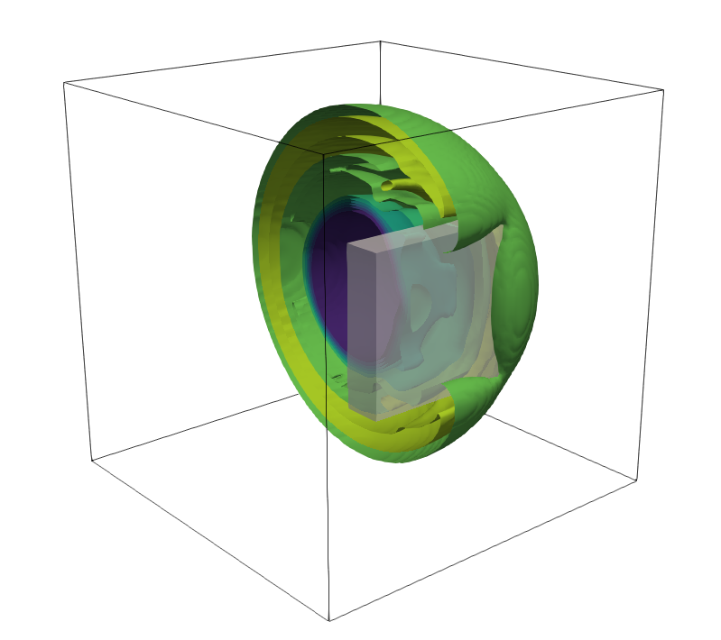

# EHOW3D (Euler High Order WENO 3D)


## Introduction

Euler solver in 3D using WENO, TENO and UWC reconstructions, SSPRK3 time updating and HLL/HLLC solvers. 

<figure style="text-align: center;">
  
</figure>


## Quick start

### Compilation

To compile using *gcc* and the OpenMP *-fopenmp* flag, type:

```
$ gcc -lm -fopenmp euler3D.c -o euler3D
```

It can also be compiled using PGI NVIDIA compiler, with the OpenMP *-mp* flag:
```
$ pgcc -mp -o euler3D euler3D.c
```

### Configuration file

The configuration file required has the following format:

```
/////SIMULATION_SETUP//////
FinalTime		0.2
DumpTime		0.05
CFL			0.25
Order			5

////////MESH_SETUP/////////
xcells			80
ycells			100
zcells			80
SizeX			0.80
SizeY			1.0
SizeZ			0.80

///////BOUNDARY_COND///////
Face_1(-y)			3
Face_2(+x)			3
Face_3(+y)			3
Face_4(-x)			3
Face_5(-z)			3
Face_6(+z)			3

///////LINEAR_TRANSPORT///////(if_applicable)
u_x                     1.0
u_y                     1.0
u_z                     1.0
```


## Documentation

### Equations solved

There is the possibility of solving:

- Linear scalar transport, setting:
```c
#define LINEAR 1 
```
and defining the x, y and z velocities in the configuration file.
- Burgers equation, setting:
```c
#define BURGERS 1 
```
- Euler equations, setting:
```c
#define EULER 1 
```

*It is possible to run a linear transport module within the euler equations, setting ```#define LINEAR_TRANSPORT 1 ```, but it is an old feature*


### The computational mesh

The computational mesh is constructed as follows:

<figure style="text-align: center;">
  
</figure>

with cell numbers in green, wall numbers in red and node numbers in blue.

Each reference element (volume cell) is defined as follows:

<figure style="text-align: center;">
  
</figure>

with wall numbers in red and node numbers in blue. These are defined in the structure ``` t_cell_``` as:
```c
struct t_cell_{
	//...
	int n1,n2,n3,n4,n5,n6,n7,n8; //ID's of the nodes 
	int w1_id,w2_id,w3_id,w4_id,w5_id,w6_id; //ID's of the walls 
	//...
}; 
```
### Solid domains

Solid domains are allowed by setting the macro: 
```c
#define ALLOW_SOLIDS 1 
```

and involve the following functions:

```c
int read_solids(t_mesh *mesh, t_solid *solids ); // Read STL triangulation files
int assign_cell_type(t_mesh *mesh,t_solid *solids); // Define ghost and solid cells
int update_stencils(t_mesh *mesh,t_sim *sim); // Update stencil sizes depending on ghost cell layers
int assign_wall_type(t_mesh *mesh); // Define calculation walls 
int assign_image_cells(t_mesh *mesh,t_solid *solids); // Define image points for immersed boundaries
int update_ghost_cells(t_sim *sim,t_mesh *mesh,t_solid *solids); // Update the values of ghost cells using image points
```
#### Reading solid geometries

The function ``` read_solids()``` read STL-type files in the following format:

```
facets: 10 
vertices: 30 

n1x	n1y	n1z
p11x	p11y	p11z
p12x	p12y	p12z
p13x	p13y	p13z

n2x	n2y	n2z
p21x	p21y	p21z
p22x	p22y	p22z
p23x	p23y	p23z

...
```
where *ni* is the normal of  *i*-th triangle (facet) and *pij* is the *j*-th node of the *i*-th triangle.

The filenames of the solid geometries must be indicated in the file ``` solids/solid_list.txt``` as follows:

```
nfiles 6
solids/geometry1.txt
solids/geometry2.txt
...
solids/geometry6.txt

```

Each solid geometry data read from each file will be stored using the following structure:

```c
struct t_stl_{
	int ntri; //number of triangular facets
	int nver; //number of vertices
	char name[256]; //solid name, e.g. solids/geometry1.txt
	double Xmin[3],Xmax[3]; //bounding box coordinates
	int imin[3],imax[3];    //bounding box indices
	t_triangle *triangle;   //array of triangular facets
	
};
```
and each triangular facet data will be stored using the following structure:

```c
struct t_triangle_{
	double nr[3],absnr; //face normal vector and its magnitude
	double p1[3],p2[3],p3[3];    //nodes defining the triangle	
	int imin[3],imax[3]; 	//bounding box of the triangular facet
};
```

#### Assigning ghost and solid cells

The function ```assign_cell_type()``` is used to define ghost and solid cells. The algorithm checks whether the cells cointained in each triangle's bounding box are below or above the surface. To do so, the distance between a cell center and the surface is computed as the projection:


where  is the vector of coordinates of the cell center and   is the vector of coordinates of the node 1 of the triangle. When , the cell *i* is located below the surface. A threshold variable ```_stol_``` is used to define the thickness of the ghost cell layer.

The coordinates of the surface intercept are defined as:


```c
xc[0]=cell[n].xc - dist*triangle[m].nr[0]; 
xc[1]=cell[n].yc - dist*triangle[m].nr[1];
xc[2]=cell[n].zc - dist*triangle[m].nr[2];
```

and the "point-inside-trianle" algorithm is used to check if  is on the surface of the triangular facet. If so, the cell may be defined as a ghost cell and the coordinates of the image point (mirroring  with respect to ) are computed as:


```c
cell[n].xim = xc[0] - dist*triangle[m].nr[0]; 
cell[n].yim = xc[1] - dist*triangle[m].nr[1];
cell[n].zim = xc[2] - dist*triangle[m].nr[2];
```
When a cell is defined as *ghost cell* (```cell[n].ghost=1;```), we set a pointer to the triangle associated to such cell:
```c
cell[n].tri=&(triangle[m]);
```

#### Computing image points and ghost cell values

For each ghost cell, the 8 closest neighbors to its image point are stored in ```cell[n].ni[8]``` and the weight of each neighbor is stored in ```cell[n].li[8]```. This weight is defined as  where   the distance between the image and the neighbor point, with *q* standing for the index of the neighbor cell. Note that a *q*-th weight is set to zero if the *q*-th neighbor is a ghost cell. The values at the image point are computed as:


### Boundary conditions

The available boundary conditions are:

* 1: Periodic.

* 3: Transmissive. The numerical flux is set as the physical flux at the interface, using:
```c 
void compute_transmissive_euler(t_wall *wall, int wp)
```

* 4: Solid wall. Defined as a slip boundary condition which is based on the HLL flux, using:
```c 
void compute_solid_euler_hlle(t_wall *wall, double *lambda_max, int wp)
```


### Spatial reconstructions

Spatial reconstructions are implemented using 1D splitting. The available reconstructions are:

- UWC 3, 5 and 7
- WENO 3, 5 and 7
- TENO 5 (requires the selection of the CT constant!)

### Time integrator

The time stepping is done using a SSPRK3 method (3-rd order of accuracy).

### Riemann solvers

The available solvers are:

- HLL solver: 
```c 
void compute_euler_HLLE(t_wall *wall,double *lambda_max) 
```
- HLLC solver: 
```c 
void compute_euler_HLLC(t_wall *wall,double *lambda_max)
```

**Note**: A positivity fix must be implemented in the HLLC solver to avoid stability issues

The x-split version of the solvers is implemented. It must be noted that the rotation matrices are simplified for the particular case of Cartesian geometries, leading to:
```c
	WL[1]=wall->UL[1]*wall->nx+wall->UL[2]*wall->ny+wall->UL[3]*wall->nz;
	WL[2]=-wall->UL[1]*wall->ny+wall->UL[2]*wall->nx+wall->UL[2]*wall->nz;
	WL[3]=wall->UL[3]*wall->nx+wall->UL[3]*wall->ny-wall->UL[1]*wall->nz;
```
where ``` WL``` is the 3D vector in the (cell) local coordinates and  ``` UL``` in the absolute coordinates.

### Parallel implementation

The code is parallelized using OpenMP. To set the number of threads, for example 24 threads, the following macro is used:
```c
#define NTHREADS 24
```
If compiling without the OMP flag, the code will run as a serial program.

## Authorship

Authors:
 - Adrián Navas Montilla
 - Isabel Echeverribar

Copyright (C) 2019-2021 The authors.  

License type: Creative Commons Attribution-NonCommercial-NoDerivs 3.0 Spain (CC BY-NC-ND 3.0 ES https://creativecommons.org/licenses/by-nc-nd/3.0/es/deed.en) under the following terms: 

- Attribution — You must give appropriate credit and provide a link to the license.
- NonCommercial — You may not use the material for commercial purposes.
- NoDerivatives — If you remix, transform, or build upon the material, you may not distribute the modified material unless explicit permission of the authors is provided. 

Disclaimer: This software is under development and it is distributed for research and/or academic purposes, WITHOUT ANY WARRANTY. In no event shall the authors be liable for any claim, damages or other liability, arising from, out of or in connection with the software or the use or other dealings in this software.

