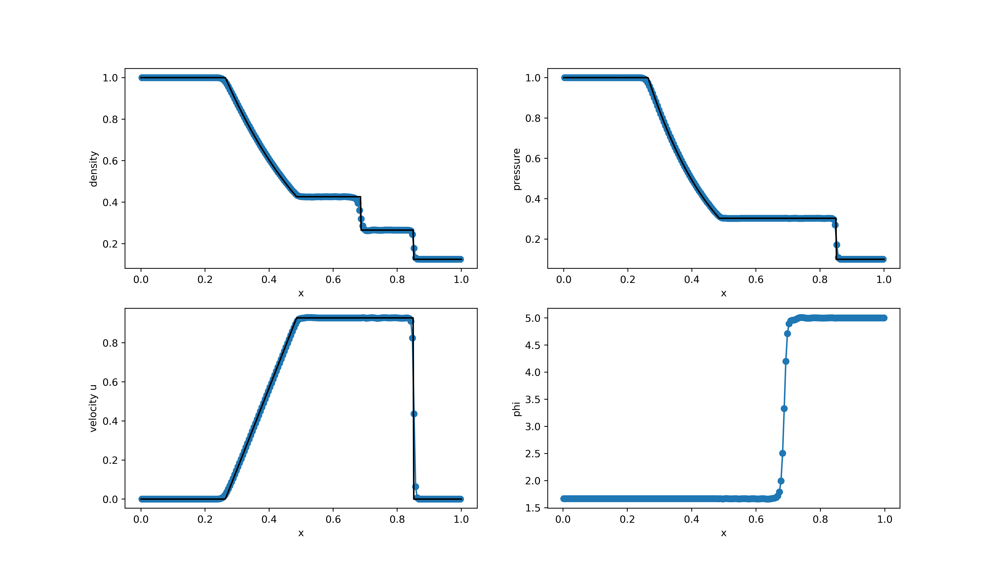
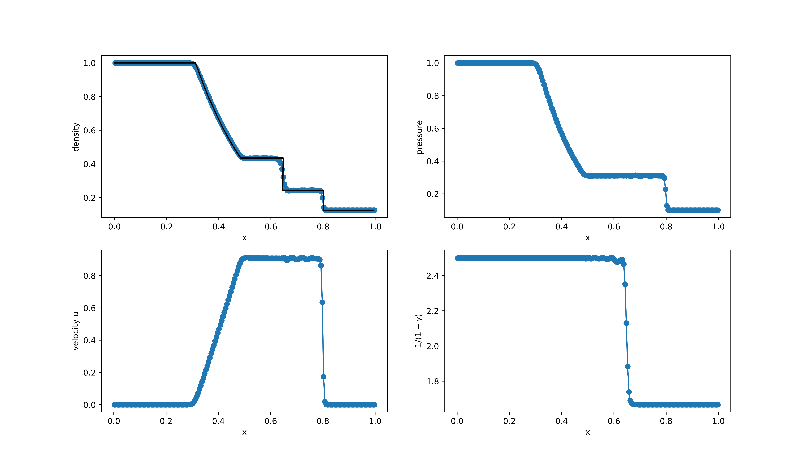

## AUTOMATIC TEST RESULTS 

The results below are automatically generated by running ```python3 python/autotest.py``` and reloading this script (using Jupyter for instance). 

### Test 1: Convergence rates

The linear transport equation is solved in 1D inside a cyclic domain x=[0,1] using the following initial conditions:

$$u(x,0)=1+0.5\sin(2\pi x)$$

The advection velocity is $a=1$ and the simulation time is t=5 s. The numerical errors are computed using the L_1 error norms by comparing with the exact solution:

$$u(x,0)=1+0.5\sin(2\pi (x-at))$$

<figure style="text-align: center;">
  
</figure>

### Test 2: Riemann Problem RP1

This RP involves a equilibrium state that must be preserved with machine accuracy by the solver:

<table>
  <tr>
    <td></td>
    <td>Left</td>
    <td>Right</td>
  </tr>
  <tr>
    <td>$\rho$</td>
    <td>1.0</td>
    <td>1.0</td>
  </tr>
  <tr>
    <td>$p$</td>
    <td>1.0</td>
    <td>1.0</td>
  </tr>
  <tr>
    <td>$u$</td>
    <td>0.0</td>
    <td>0.0</td>
  </tr>
  <tr>
    <td>$\phi$</td>
    <td>1.0</td>
    <td>0.0</td>
  </tr>
 </table>

 <figure style="text-align: center;">
  
</figure>


### Test 3: Riemann Problem RP2

This RP consists of the typical sod-shock tube problem:

<table>
  <tr>
    <td></td>
    <td>Left</td>
    <td>Right</td>
  </tr>
  <tr>
    <td>$\rho$</td>
    <td>1.0</td>
    <td>0.125</td>
  </tr>
  <tr>
    <td>$p$</td>
    <td>1.0</td>
    <td>0.1</td>
  </tr>
  <tr>
    <td>$u$</td>
    <td>0.0</td>
    <td>0.0</td>
  </tr>
  <tr>
    <td>$\phi$</td>
    <td>1.666</td>
    <td>5.0</td>
  </tr>
 </table>

 <figure style="text-align: center;">
  
</figure>


### Test 4: Riemann Problem RP3

This RP considers a nonz-zero velocity:

<table>
  <tr>
    <td></td>
    <td>Left</td>
    <td>Right</td>
  </tr>
  <tr>
    <td>$\rho$</td>
    <td>5.99924</td>
    <td>5.99242</td>
  </tr>
  <tr>
    <td>$p$</td>
    <td>460.894</td>
    <td>46.0950</td>
  </tr>
  <tr>
    <td>$u$</td>
    <td>19.5975</td>
    <td>-6.19633</td>
  </tr>
  <tr>
    <td>$\phi$</td>
    <td>1.0</td>
    <td>0.0</td>
  </tr>
 </table>

 <figure style="text-align: center;">
  
</figure>


### Test 5: Riemann Problem RP4

This is a test case from Rémi Abgrall, Smadar Karni, *Computations of Compressible Multifluids*, Journal of Computational Physics, Volume 169, Issue 2, 2001, Pages 594-623.

<table>
  <tr>
    <td></td>
    <td>Left</td>
    <td>Right</td>
  </tr>
  <tr>
    <td>$\rho$</td>
    <td>1.0</td>
    <td>0.125</td>
  </tr>
  <tr>
    <td>$p$</td>
    <td>1.0</td>
    <td>0.1</td>
  </tr>
  <tr>
    <td>$u$</td>
    <td>0.0</td>
    <td>0.0</td>
  </tr>
  <tr>
    <td>$\gamma$</td>
    <td>1.40</td>
    <td>1.60</td>
  </tr>
 </table>

 <figure style="text-align: center;">
  
</figure>


### Test 6: Colliding thermals

<figure style="text-align: center;">
  <table style="width: 100%; border-collapse: collapse;">
    <tr>
      <td style="width: 50%; text-align: center;">
        
        
        
        
      </td>
      <td style="width: 50%; text-align: center;">
        
        
        
        
      </td>
    </tr>
  </table>
</figure>
