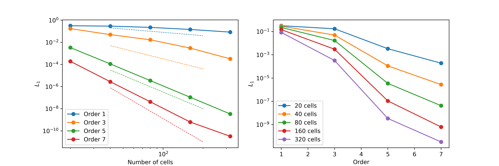

## AUTOMATIC TEST RESULTS (autotest.py)

### Test 1: Convergence rates

The linear transport equation is solved in 1D inside a cyclic domain x=[0,1] using the following initial conditions:

$$u(x,0)=1+0.5\sin(2\pi x)$$

The advection velocity is $a=1$ and the simulation time is t=5 s. The numerical errors are computed using the L_1 error norms by comparing with the exact solution:

$$u(x,0)=1+0.5\sin(2\pi (x-at))$$

<figure style="text-align: center;">
  
</figure>

### Test 2: Riemann Problem RP1

This RP involves a equilibrium state that must be preserved with machine accuracy by the solver:

<table>
  <tr>
    <td></td>
    <td>Left</td>
    <td>Right</td>
  </tr>
  <tr>
    <td>$\rho$</td>
    <td>1.0</td>
    <td>1.0</td>
  </tr>
  <tr>
    <td>$p$</td>
    <td>1.0</td>
    <td>1.0</td>
  </tr>
  <tr>
    <td>$u$</td>
    <td>0.0</td>
    <td>0.0</td>
  </tr>
  <tr>
    <td>$\phi$</td>
    <td>1.0</td>
    <td>0.0</td>
  </tr>
 </table>
