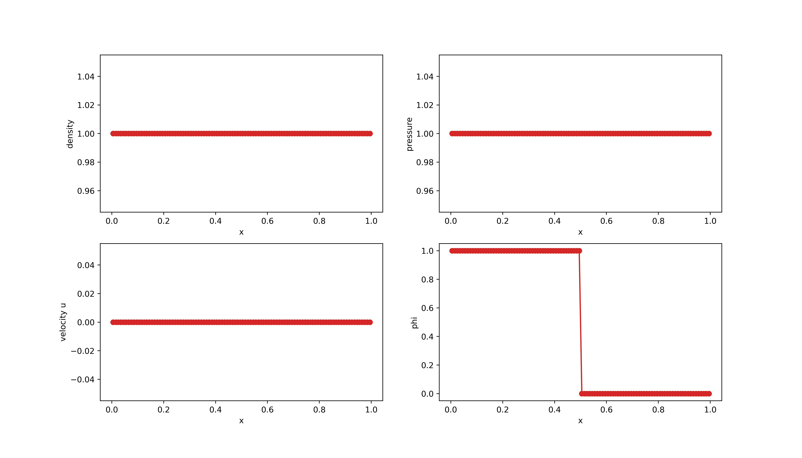
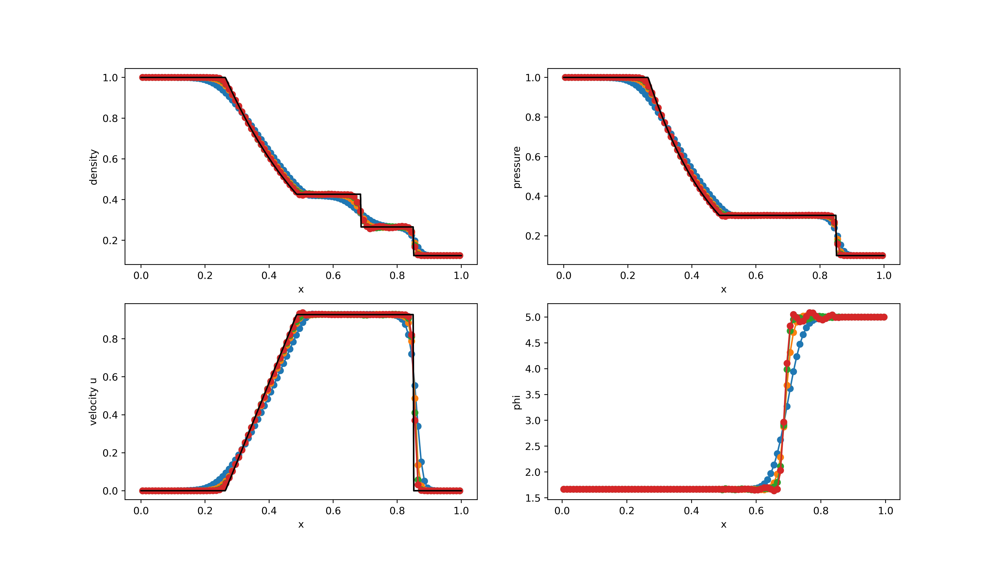
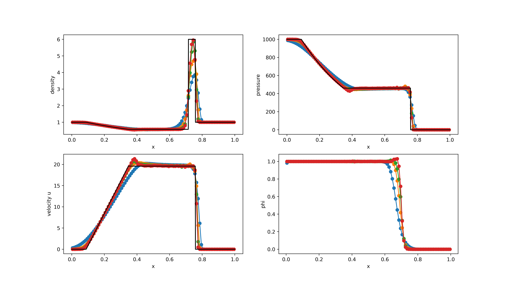

# Benchmark #1: 1D Riemann problems

The following Riemann problems are computed using the WENO method in combination with the HLLE solver. The grid is discretized in 100 computational cells. 

These cases can be computed using the Jupyter Notebook [1D_RPs.ipynb](../1D_RPs.ipynb), which can executed by running in Anaconda:
``` 
jupyter notebook 1D_RPs.ipynb
```

## RP1

<table>
  <tr>
    <td></td>
    <td>Left</td>
    <td>Right</td>
  </tr>
  <tr>
    <td></td>
    <td>1.0</td>
    <td>1.0</td>
  </tr>
  <tr>
    <td></td>
    <td>1.0</td>
    <td>1.0</td>
  </tr>
  <tr>
    <td></td>
    <td>0.0</td>
    <td>0.0</td>
  </tr>
  <tr>
    <td></td>
    <td>1.0</td>
    <td>0.0</td>
  </tr>
 </table>
 

<figure style="text-align: center;">
  
</figure>

Legend: 
 `1-st order`
 `3-rd order`
 `5-th order`
 `7-th order`


## RP2


<table>
  <tr>
    <td></td>
    <td>Left</td>
    <td>Right</td>
  </tr>
  <tr>
    <td></td>
    <td>1.0</td>
    <td>0.125</td>
  </tr>
  <tr>
    <td></td>
    <td>1.0</td>
    <td>0.1</td>
  </tr>
  <tr>
    <td></td>
    <td>0.0</td>
    <td>0.0</td>
  </tr>
  <tr>
    <td></td>
    <td>1.666</td>
    <td>5.0</td>
  </tr>
 </table>
 

<figure style="text-align: center;">
  
</figure>

Legend: 
 `1-st order`
 `3-rd order`
 `5-th order`
 `7-th order`


## RP3


<table>
  <tr>
    <td></td>
    <td>Left</td>
    <td>Right</td>
  </tr>
  <tr>
    <td></td>
    <td>1.0</td>
    <td>1.0</td>
  </tr>
  <tr>
    <td></td>
    <td>1000.0</td>
    <td>0.01</td>
  </tr>
  <tr>
    <td></td>
    <td>0.0</td>
    <td>0.0</td>
  </tr>
  <tr>
    <td></td>
    <td>1.0</td>
    <td>0.0</td>
  </tr>
 </table>
 

<figure style="text-align: center;">
  
</figure>

Legend: 
 `1-st order`
 `3-rd order`
 `5-th order`
 `7-th order`


## RP4


<table>
  <tr>
    <td></td>
    <td>Left</td>
    <td>Right</td>
  </tr>
  <tr>
    <td></td>
    <td>5.99924</td>
    <td>5.99242</td>
  </tr>
  <tr>
    <td></td>
    <td>460.894</td>
    <td>46.0950</td>
  </tr>
  <tr>
    <td></td>
    <td>19.5975</td>
    <td>-6.19633</td>
  </tr>
  <tr>
    <td></td>
    <td>1.0</td>
    <td>0.0</td>
  </tr>
 </table>
 

<figure style="text-align: center;">
  
</figure>

Legend: 
 `1-st order`
 `3-rd order`
 `5-th order`
 `7-th order`


