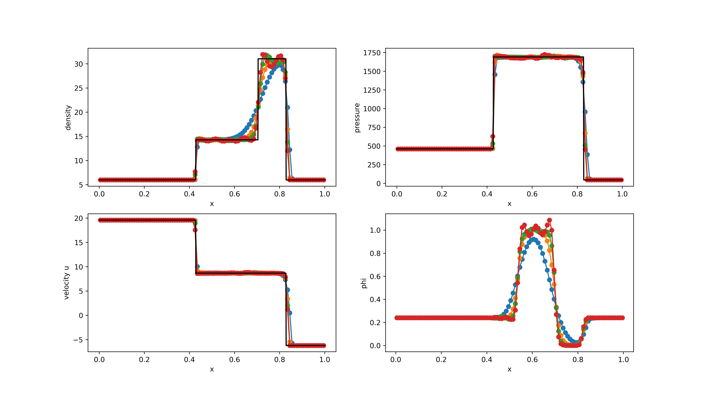

# Benchmark #1: Riemann problems

## RP1

<table>
  <tr>
    <td></td>
    <td>Left</td>
    <td>Right</td>
  </tr>
  <tr>
    <td></td>
    <td>1.0</td>
    <td>1.0</td>
  </tr>
  <tr>
    <td></td>
    <td>1.0</td>
    <td>1.0</td>
  </tr>
  <tr>
    <td></td>
    <td>0.0</td>
    <td>0.0</td>
  </tr>
  <tr>
    <td></td>
    <td>1.0</td>
    <td>0.0</td>
  </tr>
 </table>
 

<figure style="text-align: center;">
  
</figure>

## RP2

<table>
  <tr>
    <td></td>
    <td>Left</td>
    <td>Right</td>
  </tr>
  <tr>
    <td></td>
    <td>1.0</td>
    <td>0.125</td>
  </tr>
  <tr>
    <td></td>
    <td>1.0</td>
    <td>0.1</td>
  </tr>
  <tr>
    <td></td>
    <td>0.0</td>
    <td>0.0</td>
  </tr>
  <tr>
    <td></td>
    <td>1.666</td>
    <td>5.0</td>
  </tr>
 </table>
 

<figure style="text-align: center;">
  
</figure>

## RP3

<table>
  <tr>
    <td></td>
    <td>Left</td>
    <td>Right</td>
  </tr>
  <tr>
    <td></td>
    <td>1.0</td>
    <td>1.0</td>
  </tr>
  <tr>
    <td></td>
    <td>1000.0</td>
    <td>0.01</td>
  </tr>
  <tr>
    <td></td>
    <td>0.0</td>
    <td>0.0</td>
  </tr>
  <tr>
    <td></td>
    <td>1.0</td>
    <td>0.0</td>
  </tr>
 </table>
 

<figure style="text-align: center;">
  
</figure>

## RP4

<table>
  <tr>
    <td></td>
    <td>Left</td>
    <td>Right</td>
  </tr>
  <tr>
    <td></td>
    <td>5.99924</td>
    <td>5.99242</td>
  </tr>
  <tr>
    <td></td>
    <td>460.894</td>
    <td>46.0950</td>
  </tr>
  <tr>
    <td></td>
    <td>19.5975</td>
    <td>-6.19633</td>
  </tr>
  <tr>
    <td></td>
    <td>1.0</td>
    <td>0.0</td>
  </tr>
 </table>
 

<figure style="text-align: center;">
  
</figure>

