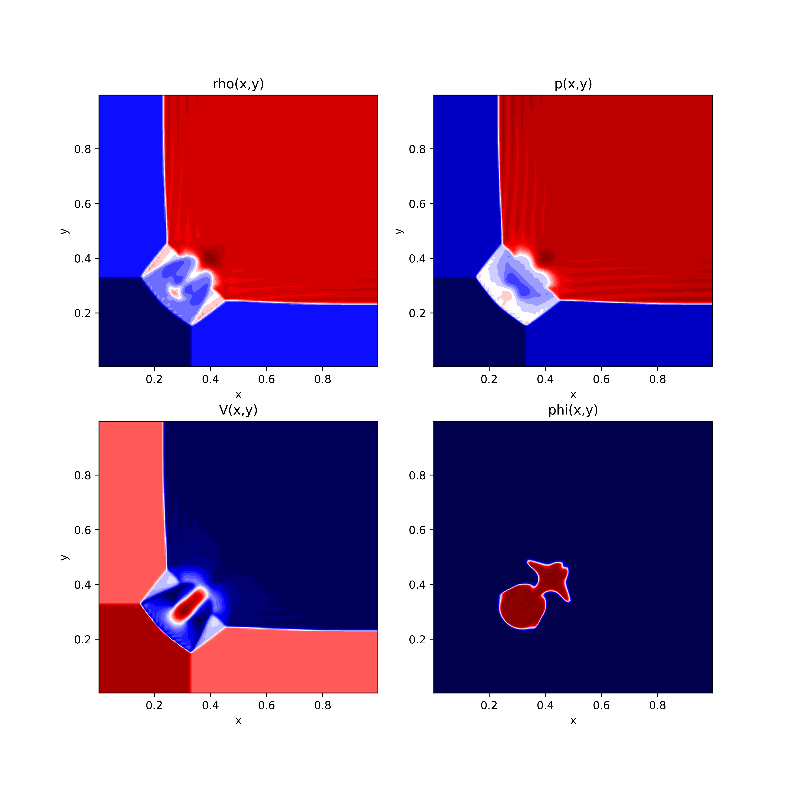
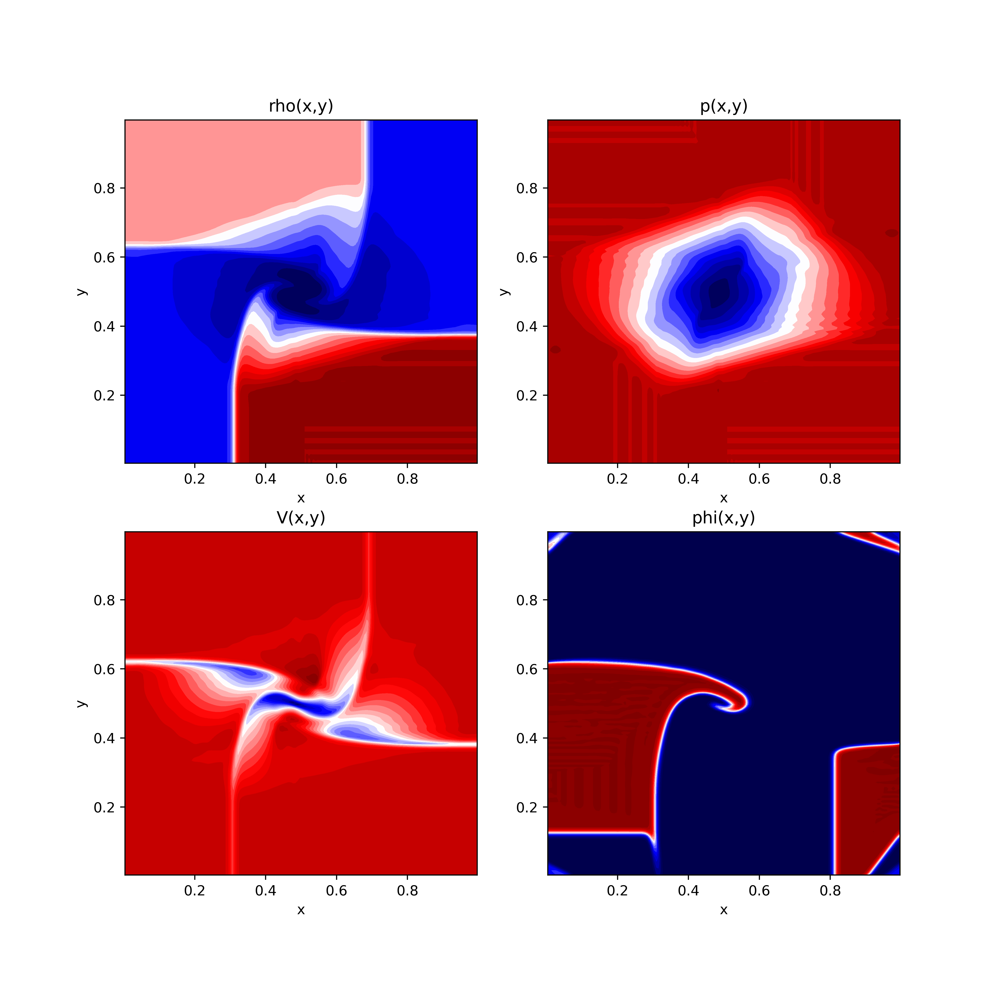
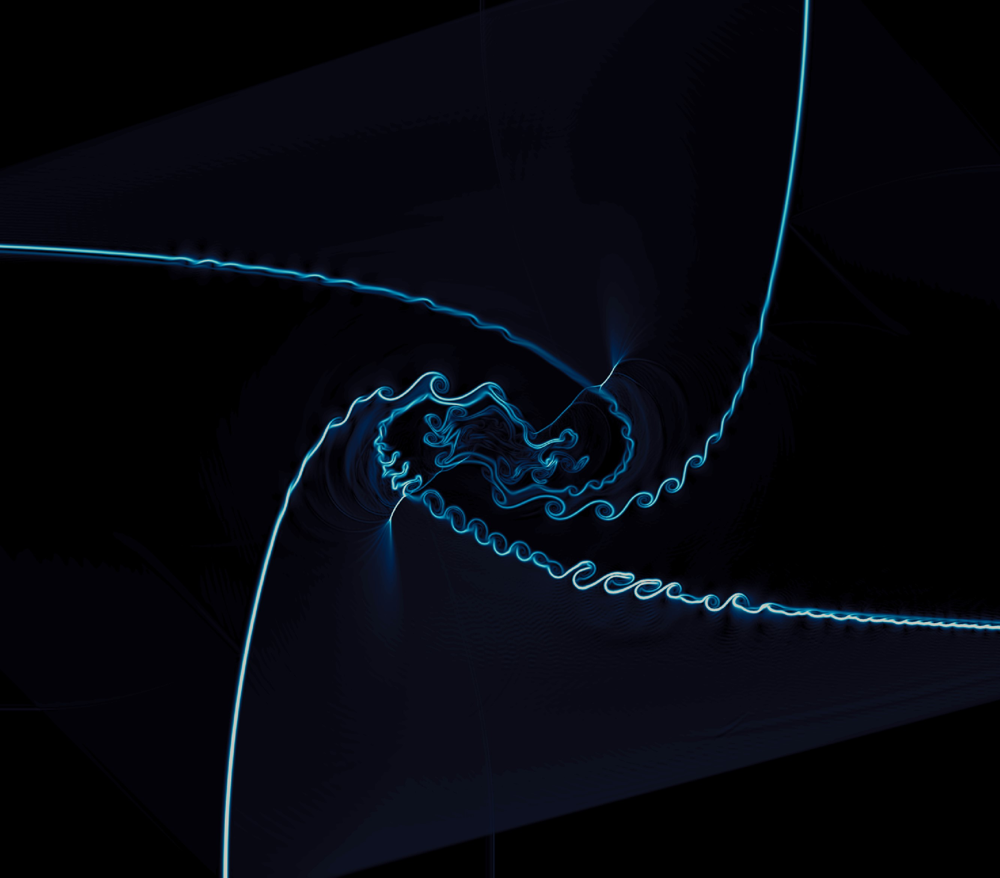

# Benchmark #2: 2D Riemann problems

The following Riemann problems are computed using the WENO method in combination with the HLLE solver. The grid is discretized in 160x160 computational cells. 

These cases can be computed using the Jupyter Notebook [2D_RPs.ipynb](../2D_RPs.ipynb), which can executed by running in Anaconda:
``` 
jupyter notebook 2D_RPs.ipynb
```

The initial condition for the Riemann problems consists of piecewise constant data in four equal square regions in which the domain is divided, identified as follows:

<table>
  <tr>
    <td>1</td>
    <td>2</td>
  </tr>
  <tr>
    <td>3</td>
    <td>4</td>
  </tr>
 </table> 

## RP1


<table>
  <tr>
    <td>


</td>
    <td>


</td>
  </tr>
    <tr>
    <td>


</td>
    <td>


</td>
  </tr>
 </table> 
 

<figure style="text-align: center;">
  
</figure>

<figure style="text-align: center;">
  
</figure>


## RP2


<table>
  <tr>
    <td></td>
    <td>Left</td>
    <td>Right</td>
  </tr>
  <tr>
    <td></td>
    <td>1.0</td>
    <td>0.125</td>
  </tr>
  <tr>
    <td></td>
    <td>1.0</td>
    <td>0.1</td>
  </tr>
  <tr>
    <td></td>
    <td>0.0</td>
    <td>0.0</td>
  </tr>
  <tr>
    <td></td>
    <td>1.666</td>
    <td>5.0</td>
  </tr>
 </table>
 
<figure style="text-align: center;">
  
</figure>

<figure style="text-align: center;">
  
</figure>