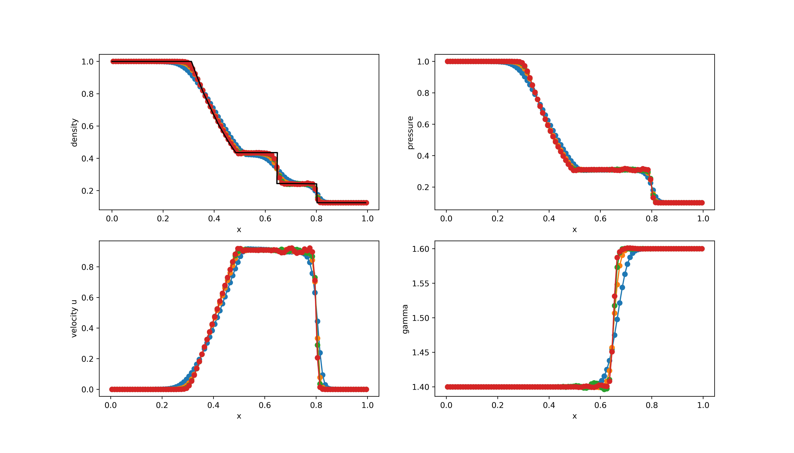

# Benchmark #3: Two-fluid mixture problem

The following Riemann problems are computed using the WENO method in combination with the HLLE solver. The grid is discretized in 100 computational cells. The multi-fluid solver is activated with the following macros:

```c
#define MULTICOMPONENT 0 
#define MULTI_TYPE 2    
```

These cases can be computed using the Jupyter Notebook [1D_multicomponent.ipynb](../1D_RPs.ipynb), which can be executed by running in Anaconda:
``` 
jupyter notebook 1D_multicomponent.ipynb
```

## RP1

This is a test case from *Rémi Abgrall, Smadar Karni, Computations of Compressible Multifluids, Journal of Computational Physics, Volume 169, Issue 2, 2001, Pages 594-623*.

Time: t=0.16

<table>
  <tr>
    <td></td>
    <td>Left</td>
    <td>Right</td>
  </tr>
  <tr>
    <td></td>
    <td>1.0</td>
    <td>1.0</td>
  </tr>
  <tr>
    <td></td>
    <td>1.0</td>
    <td>1.0</td>
  </tr>
  <tr>
    <td></td>
    <td>0.0</td>
    <td>0.0</td>
  </tr>
   <tr>
    <td></td>
    <td>1.4</td>
    <td>1.6</td>
  </tr>
 </table>
 

<figure style="text-align: center;">
  
</figure>

Legend: <span style="color:blue"> *1-st order* text</span>, <span style="color:orange"> *3-rd order* text</span>, <span style="color:green"> *5-th order* text</span>, <span style="color:red"> *7-th order* text</span>

 `7-th order`