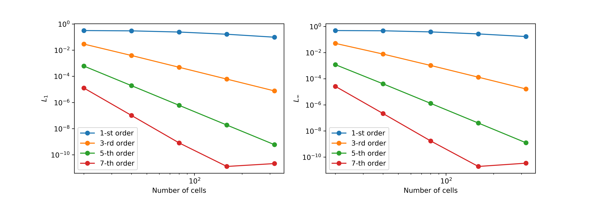
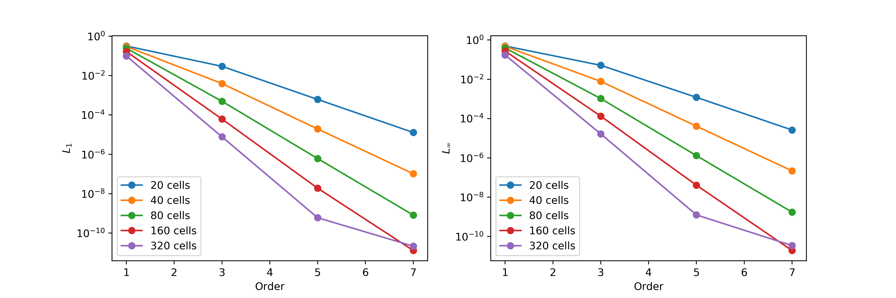

# Benchmark #4: Convergence rate test

The Euler equations are computed inside a cyclic domain x=[0,1] using the following initial conditions:

setting up a linear transport problem. The simulation time is t=5 s. The numerical errors are computed using the L_1 and L_inf error norms by comparing with the exact solution:

### h-refinement

<figure style="text-align: center;">
  
</figure>

### p-refinement

<figure style="text-align: center;">
   
</figure>

