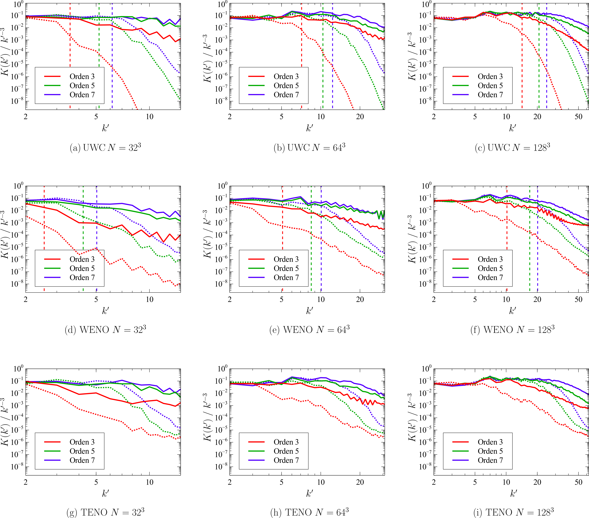
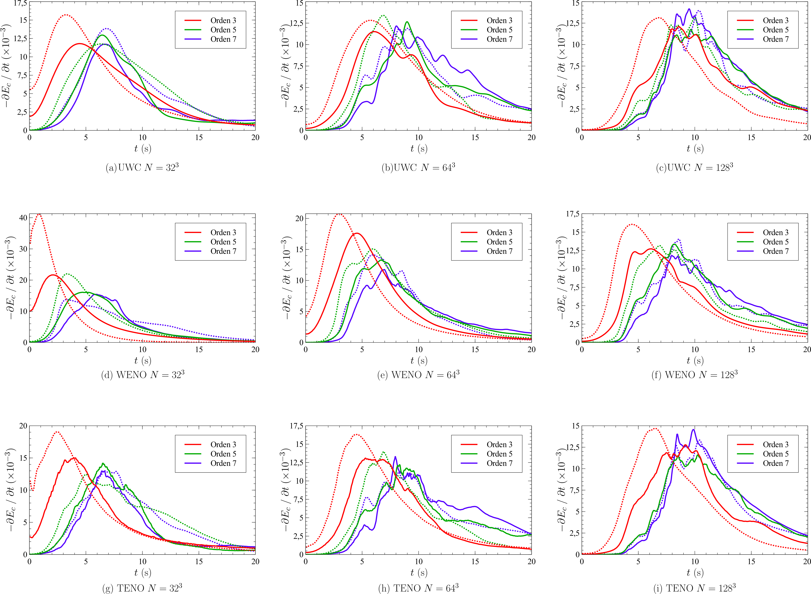

# Benchmark #5: Taylor-Green vortex

Compressible turbulence is a highly nonlinear multiscale phenomenon. It has become one of the most challenging problems in computational physics. Turbulent flows can be numerically reproduced by means of hydrodynamic solvers. A common approach is the use of the Euler equations in combination with a suitable numerical discretization scheme. When the numerical diffusion inherent to the discretization method mimics the physical dissipation of the unresolved turbulent motion, the approach is called Implicit Large Eddy Simulation (ILES). 

ILES methods accurately reproduce the statistical behavior of turbulent flows. The  truncation errors of the scheme play the role of the common sub-grid scale filters used in traditional LES methods. High-fidelity simulations can be achieved when using this approach. The high order UWC, WENO and TENO schemes implemented in this code allow the simulation of turbulent flows using a ILES framework. However, the performance of the model strongly depends on the actual dissipation associated to the numerical scheme. To assess the numerical dissipation of the schemes implemented in EHOW-3D and their suitability to compute turbulent flows, we use the Taylor-Green vortex problem.

The Taylor-Green vortex (TGV) problem is a canonical flow that contains the features of real flows, requiring the solution of the Navier–Stokes equations in 3D at moderate Reynolds numbers. From a particular smooth initial datum, vortex stretching mechanisms cause the flow to decay along a well-defined trajectory, generating a broad turbulent spectrum (Bull and Jameson, 2015). The resolution of this flow, ensuring the correct energy dissipation rate, is challenging. Here, we show the performance of the 3-rd, 5-th and 7-th order WENO and UWC schemes for the computation of the TGV problem. The energy-based dissipation rate and the kinetic energy cascade is shown for different orders of accuracy and computational grids. The details of the configuration of the case can be found here: *Ritos, K., Kokkinakis, I. W., & Drikakis, D. (2018). Performance of high-order implicit large eddy simulations. Computers & Fluids, 173, 307-312.* The results presented below are in agreement with those obtained in such paper.

The following figures show the kinetic energy spectrum for the 3-rd, 5-th and 7-th order schemes in grids composed of 32x32x32, 64x64x64 and 128x128x128 cells. The continuous line results are obtained with the HLLC solver, and the dashed line with the HLLE solver.

<figure style="text-align: center;">
  
</figure>

The following figures show the kinetic energy dissipation for the 3-rd, 5-th and 7-th order schemes in grids composed of 32x32x32, 64x64x64 and 128x128x128 cells.

<figure style="text-align: center;">
  
</figure>
