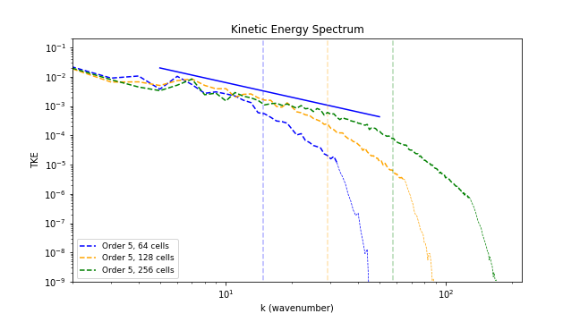

# Benchmark #5: Taylor-Green vortex

Compressible turbulence is a highly nonlinear multiscale phenomenon. It has become one of the most challenging problems in computational physics. Turbulent flows can be numerically reproduced by means of hydrodynamic solvers. A common approach is the use of the Euler equations in combination with a suitable numerical discretization scheme. When the numerical diffusion inherent to the discretization method mimics the physical dissipation of the unresolved turbulent motion, the approach is called Implicit Large Eddy Simulation (ILES). 

ILES methods accurately reproduce the statistical behavior of turbulent flows. The  truncation errors of the scheme play the role of the common sub-grid scale filters used in traditional LES methods. High-fidelity simulations can be achieved when using this approach. The high order UWC, WENO and TENO schemes implemented in this code allow the simulation of turbulent flows using a ILES framework. However, the performance of the model strongly depends on the actual dissipation associated to the numerical scheme.

The Taylor-Green vortex

<figure style="text-align: center;">
  
</figure>