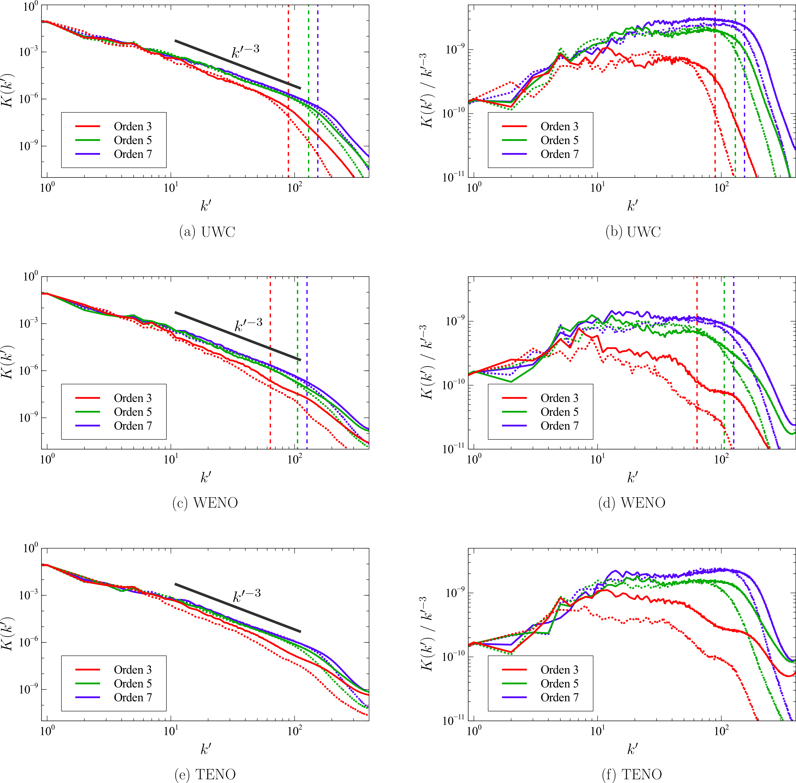
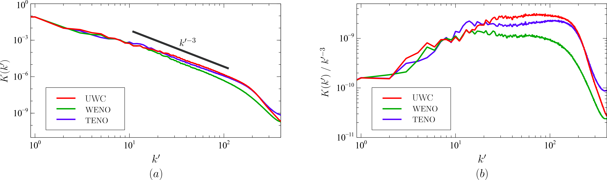

# Benchmark #6: Kelvin-Helmholtz instability

The following figures show the density for the 3-rd, 5-th and 7-th order schemes in grids composed of 100x100 cells.
<figure style="text-align: center;">
  
</figure>

The following figures show the density for the 3-rd, 5-th and 7-th order schemes in grids composed of 800x800 cells.
<figure style="text-align: center;">
  
</figure>

The following figures show the kinetic energy spectrum for the 3-rd, 5-th and 7-th order schemes in grids composed of 800x800 cells. The vertical lines represent the values predicted in *P. Solán-Fustero, E. Navas-Montilla A. Ferrer, J. Manzanero y P. García-Navarro. Application of approximate dispersion-diffusion analyses to under-resolved Burgers turbulence using high resolution WENO and UWC schemes. Journal of Computational Physics. 435 (2021).*
<figure style="text-align: center;">
  
</figure>

This figure shows the same kinetic energy spectrum for 7-th order schemes as before, for comparison.
<figure style="text-align: center;">
  
</figure>
