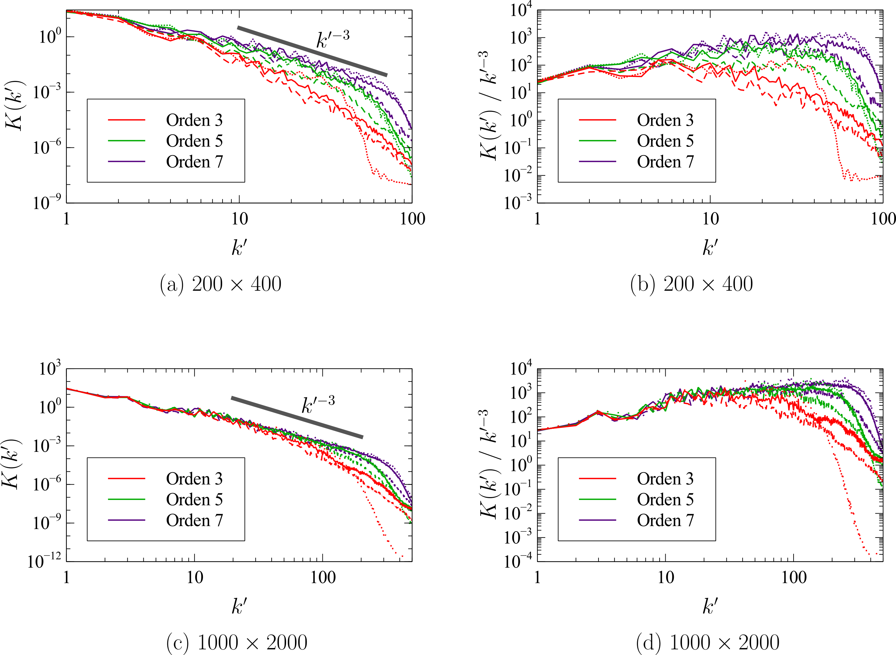

# Benchmark #7: Colliding thermals

The colliding thermals test case, recently proposed by Norman (2021), involves the collision of two thermal bubbles moving in opposite directions, which produce strong gradients of potential temperature. It was designed to evidence the performance of the schemes when handling strong winds, strong turbulence and sharp gradients. For this case, the background equilibrium state is the adiabatic equilibrium.

<figure style="text-align: center;">
  
</figure>

<figure style="text-align: center;">
  
</figure>
