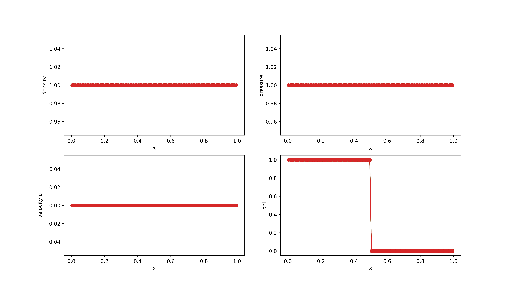

# Benchmark tests

## Benchmark #1: Riemann problems

### RP1

<table>
  <tr>
    <td></td>
    <td>Left</td>
    <td>Right</td>
  </tr>
  <tr>
    <td></td>
    <td>3.76797557</td>
    <td>2.93738973</td>
  </tr>
 </table>

<figure style="text-align: center;">
  
</figure>

### RP2