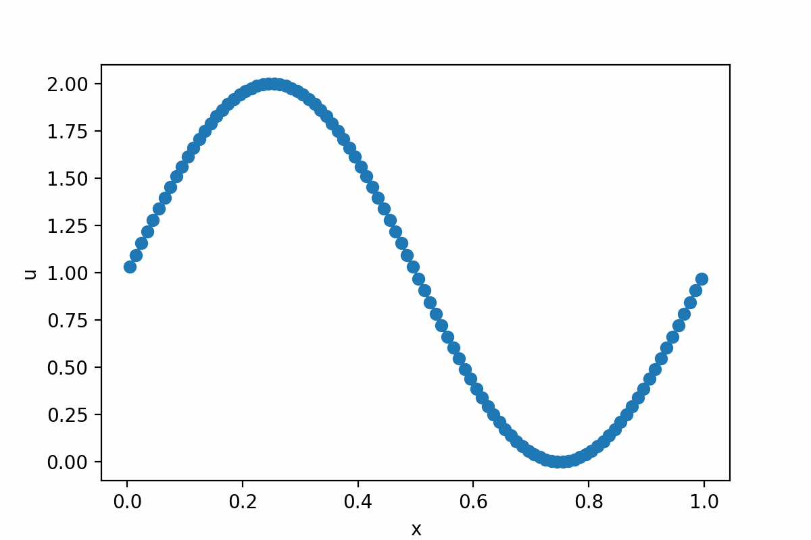
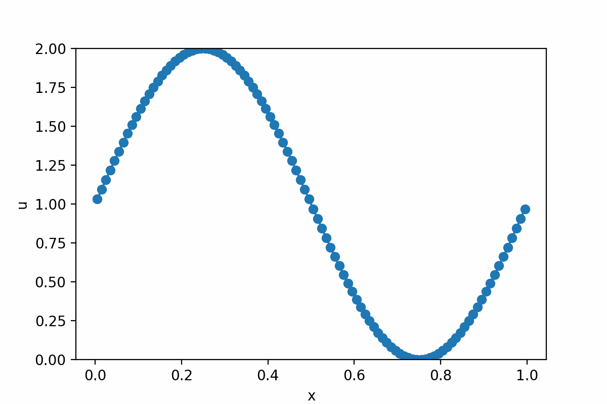
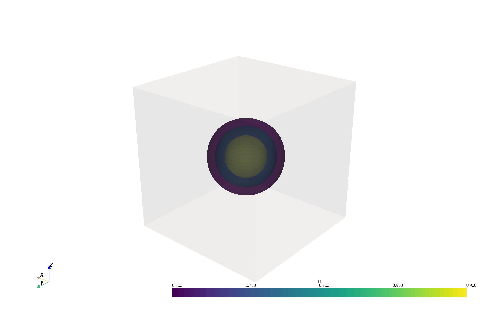
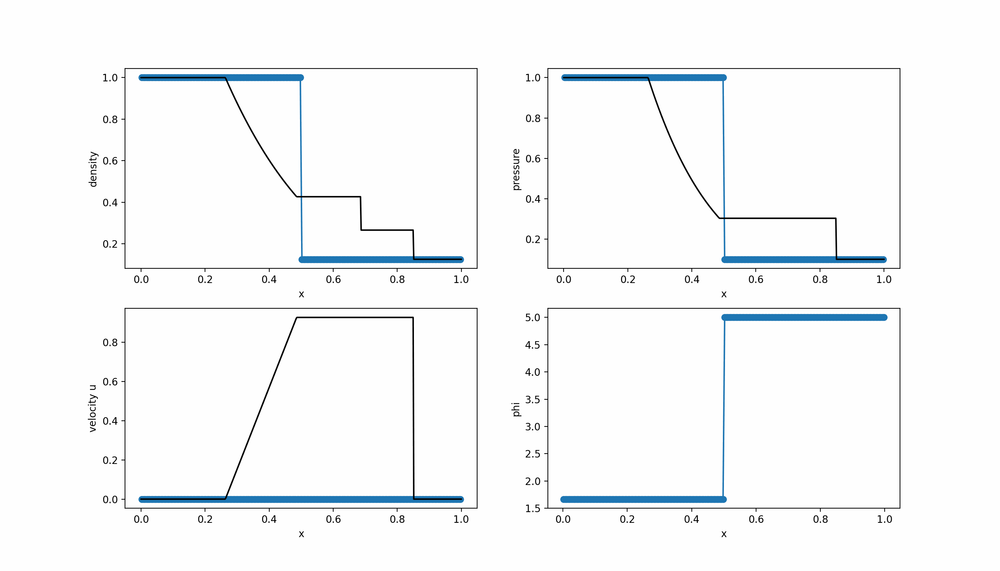
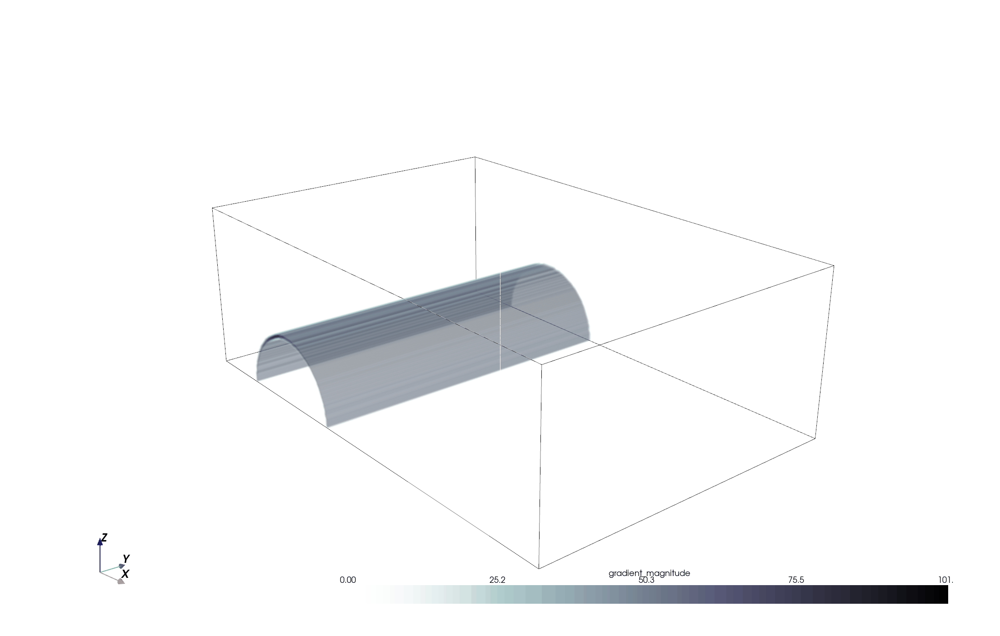
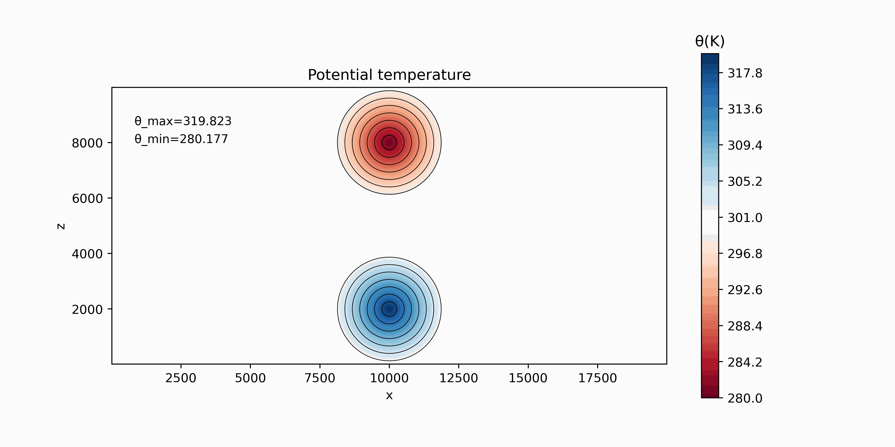

## Example problems


- [Scalar problems](#scalar-problems)
- [Compressible flow (homogeneous Euler equations)](#compressible-flow-(homogeneous-euler-equations))
- [Atmospheric flow (Euler equations with gravity source term)](#atmospheric-flow-euler-equations-with-gravity-source-term)

### Scalar problems

- Setting up a 1D linear transport case: [caseLinear](../python/caseLinear.py) ```python3 python/caseLinear.py```
  
  <figure style="text-align: center;">
  
  </figure>

- Setting up a 1D Burgers problem: [caseBurgers](../python/caseBurgers.py) ```python3 python/caseBurgers.py```
  
  <figure style="text-align: center;">
  
  </figure>

- Setting up a 3D linear transport case: [caseLinear3D](../python/caseLinear3D.py) ```python3 python/caseLinear3D.py```
  
  <figure style="text-align: center;">
  
  </figure>

### Compressible flow (homogeneus Euler equations)

- Setting up a 1D Riemann Problem for the  Euler equations (sod shock problem) [1]: [caseRP](../python/caseRP.py) ```python3 python/caseRP.py```

  <figure style="text-align: center;">
  
  </figure>
  
- Setting up a 2D Riemann Problem for the Euler equations [2]: [caseRP2D](../python/caseRP2D.py) ```python3 python/caseRP2D.py```

  <figure style="text-align: center;">
  
  </figure>
  
- Setting up a 3D Riemann Problem for the Euler equations [3]: [caseRP3D](../python/caseRP3D.py) ```python3 python/caseRP3D.py```

  <figure style="text-align: center;">
  
  </figure>
  
- Advanced case: the shock-bubble test case [4]: [caseShockBub](../python/caseShockBub.py) ```python3 python/caseShockBub.py```

  <figure style="text-align: center;">
  
  </figure>
  
- Advanced case: shock-cylinder interaction [5]: [caseShockCyl](../python/caseShockCyl3D.py) [caseShockCyl_plots](../python/caseShockCyl3D_plots.py) ```python3 python/caseShockCyl.py; python3 python/caseShockCyl_plots.py;```
  
  <figure style="text-align: center;">
  
  </figure>
  
- Advanced case: shock-induced turbulent mixing (Richtmeyer Meshkov instability): [caseRM3D](../python/caseRM3D.py) [caseRM3D_plots](../python/caseRM3D_plots.py) ```python3 python/caseRM3D.py; python3 python/caseRM3D_plots.py;```
  
  <figure style="text-align: center;">
  
  </figure>
  
### Atmospheric flow (Euler equations with gravity source term)
  
- Setting up a 2D atmospheric simulation case (colliding thermals test case) [6]: [caseCollidingBub](../python/caseCollidingBub.py) ```python3 python/caseCollidingBub.py```
    
    <figure style="text-align: center;">
    
    </figure>
    
- Setting up a 3D atmospheric simulation case (colliding thermals test case): [caseCollidingBub3D](../python/caseCollidingBub3D.py) [caseCollidingBub3D_plots](../python/caseCollidingBub3D_plots.py) ```python3 python/caseCollidingBub.py```
    
    <figure style="text-align: center;">
    
    </figure>
    
References and sources for the cases above:

[1] Sod, G. A. (1978). A Survey of Several Finite Difference Methods for Systems of Nonlinear Hyperbolic Conservation Laws", IJournal of Computational Physics, 1978, 27 (1), pp. 1-31.

[2] Lax, P. D., & Liu, X. D. (1998). Solution of two-dimensional Riemann problems of gas dynamics by positive schemes. SIAM Journal on Scientific Computing, 19(2), 319-340.

[3] Nils Hoppe, Nico Fleischmann, Benedikt Biller, Stefan Adami, Nikolaus A. Adams, A systematic analysis of three-dimensional Riemann problems for verification of compressible-flow solvers, Computers & Fluids, Volume 278, 2024, 106298

[4] Mandli, K.T., Ahmadia, A.J., Berger, M.J., Calhoun, D.A., George, D.L.,Hadjimichael, Y., Ketcheson, D.I., Lemoine, G.I., LeVeque, R.J., 2016.Clawpack: building an open source ecosystem for solving hyperbolic PDEs. PeerJ Computer Science. doi:10.7717/peerj-cs.

[5] Langseth, J.O. (2001). 3D Visualization of Shock Waves Using Volume Rendering. In: Toro, E.F. (eds) Godunov Methods. Springer, New York, NY. 

[6] Norman, M. R. (2021). A high-order WENO-limited finite-volume algorithm for atmospheric flow using the ADER-differential transform time discretization. Quarterly Journal of the Royal Meteorological Society, 147(736), 1661-1690.

