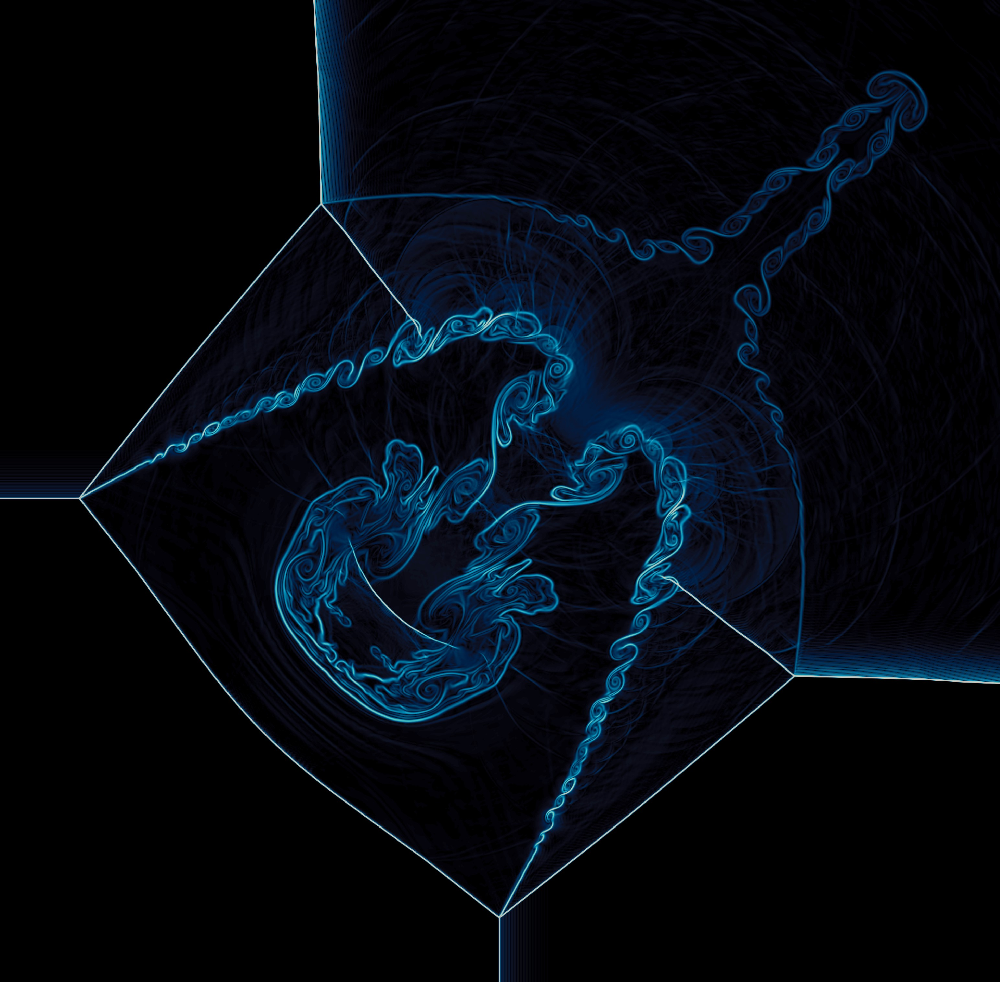

# Summary

In the last decade, very high order numerical methods have become very popular within the Computational Fluid Dynamics (CFD) and Numerical Weather Prediction (NWP) communities. Traditional low order --i.e. equal or lower than 2-- methods have been widely adopted by industry and academia to simulate fluid flows, but they exhibit important limitations due to high diffusion and dispersion errors which may lead to non-physical solutions. By contrast, high order schemes are able to provide accurate solutions, with small diffusion and dispersion errors, and feature a high computational efficiency [@FERRER2023108700;@wang2013high]. They are well suited for multi-scale problems, e.g. turbulent flows, flows involving sharp gradients such as shocks, acoustics, etc. High order solvers  have gained attention due to their notable performance when running on modern High-Performance Computing (HPC) architectures.

`CÆLUM` is a hydrodynamic solver for compressible flows, which solves the Euler equations of gas dynamics and other related models by means of very high-order essentially non-oscillatory finite volume schemes in cartesian meshes. The core of the solver is written in C but pre- and post-processing can be easily done using Jupyter Notebook as provided in the examples. The Weighted Essentially Non-Oscillatory (WENO) [@jiang1996efficient] and Targeted Essentially Non-Oscillatory (TENO) [@fu2019very] spatial reconstructions, in combination with Runge-Kutta integrators  [@gottlieb2001strong], are used in `CÆLUM` to achieve a high resolution in smooth regions of the flow and to capture discontinuous solutions without spurious oscillations. These schemes also make it possible to adopt an Implicit Large Eddy Simulation (iLES) framework when computing turbulent flows [@grinstein2007implicit; @solan2021application; @san2015evaluation]. The numerical diffusion plays the role of the explicit dissipative sub-grid model--a favorable choice when seeking simplicity and computational efficiency. In summary, this hydrodynamic solver can compute turbulent compressible flows, as well as low Mach number flows such as simplified dry atmospheric flows and other wave-propagation phenomena. 

# Statement of need

Given the limitations of traditional low-order numerical methods mentioned above, there is a critical need for advanced, high-order computational tools. The increasing complexity of engineering and scientific problems motivates a shift toward methods that can deliver both high accuracy and computational efficiency. Therefore, it is important to popularize such methods and make them available to the scientific community, in particular, for students and early-career researchers who are often limited by the accessibility of these tools.

`CÆLUM` is designed to be used both by researchers and by students in the field of CFD, atmospheric flows and related disciplines. In fact, the simplicity and compactness of the code make it particularly suitable for those taking their first steps in numerical flow simulation with high-order methods. It is designed from an academic perspective, where clarity and accessibility are prioritized. Therefore, it includes user-friendly pre-processing and post-processing tools based on Python and Jupyter Notebook. The repository comes with a series of Python scripts for the configuration and visualization of various example flows, ranging from simple scalar advection in 1D to more complex atmospheric or compressible flow cases in 3D. These scripts rely on standard libraries such as `numpy`, `matplotlib` and `pyvista`, the latter being a powerful module for data visualization and rendering. Additionally, several Jupyter Notebooks are included, where the steps for configuring the simulation tool and visualizing the results are explained in detail.

A key feature of this software is that it also allows the simulation of simplified dry atmospheric flows in the meso- and micro-scale. For this, `CÆLUM` uses the compressible Euler equations with the gravity source term, composed by the equations for the conservation of mass, momentum and energy [@ghosh2016well]. This approach offers several benefits for the selected application, such as the ability to conserve mass and energy with machine accuracy when using a suitable discretization. Another benefit of this approach is that many numerical advances developed by the CFD community can be easily adapted [@giraldo2008study].

Regarding numerics, the simulation code uses WENO [@jiang1996efficient], TENO [@fu2019very], and optimal polynomial reconstructions on Cartesian meshes. For simplicity, a discretization strategy based on the midpoint rule that employs independent 1D reconstructions in each Cartesian direction is used [@zhang2011]. This approach avoids performing multi-dimensional reconstructions and Gaussian integration at the cell faces, thereby drastically reducing the complexity of the algorithms as well as computational expenses. This is done at the cost of not achieving a genuinely high order of accuracy, which is not critical when computing shocked problems, underresolved flows, or flows with discontinuities and sharp gradients [@zhang2011; @san2015evaluation; @fu2019low]. As a result, we provide a simple and versatile computational code that can be applied to a wide variety of problems and enables iLES. 

{ width=50% }

As an example, \autoref{fig:example} displays the solution provided by `CÆLUM` of a 2D Riemann Problem from @lax1998solution, which is a typical benchmark for this type of simulation code.  The figure shows the density gradient representation, which reveals the main features of the flow. Shock waves as well as slip --i.e. contact-- lines where Kelvin-Helmholtz vortices form are accurately captured. 

Regarding the implementation of the solver, `CÆLUM` uses OpenMP, a directive-based threading library that allows parallel computing on multi-core CPUs. The modification of the base code by the inclusion of pragmas is minimal, preserving the readability and clarity of the code.

We can find other open-source simulation codes using high order non-oscillatory finite volume and finite difference schemes for the more general Navier-Stokes equations, aimed at similar applications, which show a superior performance than most state-of-the-art commercial codes. Some examples are OpenSBLI [@lusher2021opensbli], a powerful framework for code generation and HPC execution of high order solvers for CFD; HTR Solver [@di2020htr], which is a GPU-accelerated, TENO-based Direct Numerical Simulation (DNS) solver of transitional and turbulent hypersonic turbulent flows at high enthalpies, and accounts for thermochemical effects; JAX-Fluids [@bezgin2023jax], offering a user-friendly fully-differentiable CFD solver for 3D, compressible single-phase and two-phase flows, using WENO and TENO schemes and being GPU- and TPU-accelerated;  UCNS3D solver [@ANTONIADIS2022108453], a powerful high-order, finite-volume CFD solver that allows an extensive choice of numerical methods and sub-grid models and runs in HPC facilities; URANOS [@de2023uranos], a massively parallel GPU-accelerated compressible flow solver for high-fidelity modeling of compressible wall flows (DNS, LES and WMLES); STREAmS [@bernardini2021streams],  a GPU-accelerated  high-fidelity solver for direct numerical simulations (DNS) of canonical compressible wall-bounded flows; HyPar [@hypar], a  finite-difference solver for the computation of hyperbolic-parabolic partial differential equations with source terms on Cartesian grids, which considers (dry) atmospheric applications; and Cerisse [@cerisse], a GPU-accelerated solver for LES and DNS of high-speed compressible turbulent reactive flows, with customizable thermodynamics and complex chemistry. We can also find finite volume solvers aimed exclusively at atmospheric applications, such as the OpenFoam-based GEA [@girfoglio2023validation] and PortUrb [@egusphere-2025-1135; @norman2023investigating], a flexible HPC, WENO-based model for the moist atmosphere.

Similarly, there are other open-source solvers based on  the Discontinuous Galerkin method such as HORSES3D [@FERRER2023108700], which is a very powerful multiphysics environment that solves the  Navier-Stokes equations, the Cahn–Hilliard equation and their entropy–stable variants and can be applied to a wide range of applications including industrial turbulent flows, multi-phase flows and aeroacustics; GALÆEXI [@kempf2024gal], a GPU-enabled, high-order numerical framework for solving PDEs, with a special focus on turbulent flows and shock-turbulence interaction; Nek5000 [@markidis2015openacc], a well-known computational fluid dynamics solver that is very efficient, scalable and ideally suited to wall-bound and complex geometry problems; and NebulaSEM [@Abdi2024], a recent open-source code that combines FV and DG with adaptive mesh refinement to construct a high-order non-hydrostatic dynamical core for atmospheric simulations and other applications. 

Compared to DG-FEM approaches (and hybrid DG-FEM variants), high-order finite volume methods generally offer lower algorithmic and implementation complexity, retaining robustness and simplicity in handling shocks and discontinuities. This motivates the choice of this family of methods in `CÆLUM`. This is done at the cost of a lower formal accuracy per degree of freedom and a non-local nature when compared with DG-FEM methods, which may sometimes compromise computational efficiency --i.e., they rely on wider stencils that hinder parallel scalability.  

`CÆLUM` represents an alternative to the open-source codes listed above, offering the features detailed earlier in this section. It is targeted at those seeking a simpler, more academic tool, as it is designed to be pedagogical and versatile in terms of applications, and it includes explanatory notebooks. It can also serve as a testbed for evaluating novel Riemann solvers and spatial reconstruction methods. A key feature not found in other packages is the implementation of well-balanced TENO schemes for the Euler equations with gravity, used to simulate simplified atmospheric flows, including different approaches for integrating source terms, each with a distinct impact on energy conservation [@NAVASMONTILLA2024]. As an academic code, it may have some limitations when applied to realistic cases particularly due to its reliance on a uniform structured mesh.

# The model equations

We herein consider the compressible Euler equations with gravitational source term, given by
\begin{align}
\frac{\partial \rho}{\partial t} + \nabla \cdot (\rho \mathbf{v}) &= 0 \tag{Continuity} \\
\frac{\partial (\rho \mathbf{v})}{\partial t} + \nabla \cdot \left(\rho \mathbf{v} \otimes \mathbf{v} + p \mathbf{I}\right) &= \rho \mathbf{g} \tag{Momentum} \\
\frac{\partial E}{\partial t} + \nabla \cdot \left((E + p) \mathbf{v}\right) &= \rho \mathbf{v} \cdot \mathbf{g} \tag{Energy}
\end{align}
where $\rho$ is density, $\mathbf{v}$ is the velocity vector, $p$ is pressure, $\mathbf{g}=(0,0,-g)^T$ is the specific gravity force and $\mathbf{I}$ is the identity matrix. The energy is defined as  the sum of kinetic and internal energy $E=\rho(\frac{1}{2}\mathbf{v}\cdot \mathbf{v}+e)$. 

Additionally, scalar transport can also be considered as the following equation is implemented
$$\frac{\partial u}{\partial t} + \nabla \cdot ( \mathbf{v} u) = 0$$
where $u$ is the transported quantity and $\mathbf{v}$ is the advection velocity.  It is also possible to compute the Burgers equation when setting $\mathbf{v}=1/2(u,u,u)^T$. 

Further details on the model equations and numerical resolution methods can be found in [@NAVASMONTILLA2023; @NAVASMONTILLA2024].

# Previous work using the software

`CÆLUM` was developed and first used in @NAVASMONTILLA2023 presenting novel methodology to construct very high order well-balanced schemes for the computation of the Euler equations with gravitational source term, with application to NWP. The objective of this work was twofold: first, to assess the use of augmented solvers in computing the Euler equations with gravity, and second, to evaluate the performance of the novel TENO reconstruction for NWP. Afterwards, a more traditional implementation of the Euler equations with gravity based on the use of fluctuation variables was implemented in different forms to also allow for the conservation of total energy. The resulting schemes were evaluated in terms of their spectral resolution for the computation of turbulent flows in the dry atmosphere. The results were presented in @NAVASMONTILLA2024, with the objective of determining whether or not these models can be used to build an iLES framework, shedding light on their potential advantages or limitations in representing under-resolved atmospheric processes in the meso- and micro-scales.

# Example cases

The example cases provided in the repository showcase a diverse suite of test problems that are commonly used to validate and demonstrate the capabilities of computational fluid dynamics codes. These include scalar problems like linear advection and Burgers' equation in 1D, 2D and 3D, compressible flow simulations such as Riemann problems (single- and multi-component flow), shock–bubble interactions, and a Richtmyer–Meshkov instability for turbulent mixing. Additionally, atmospheric flow cases feature colliding thermal bubbles and descending thermal plumes over complex terrain.  Each case is supported by Python scripts (or Jupyter notebooks) and corresponding visual animations, making them useful for verifying the numerical solvers and exploring the underlying physical phenomena. Apart from this, the code also provides an automated testing script that performs a convergence rate test, executes four Riemann problems, and runs an atmospheric flow benchmark.

# Acknowledgements

Part of this work has been funded by the Spanish Ministry of Science, Innovation and Universities - Agencia Estatal de Investigación (10.13039/501100011033) and FEDER-EU under project-nr. PID2022-141051NA-I00.

# References